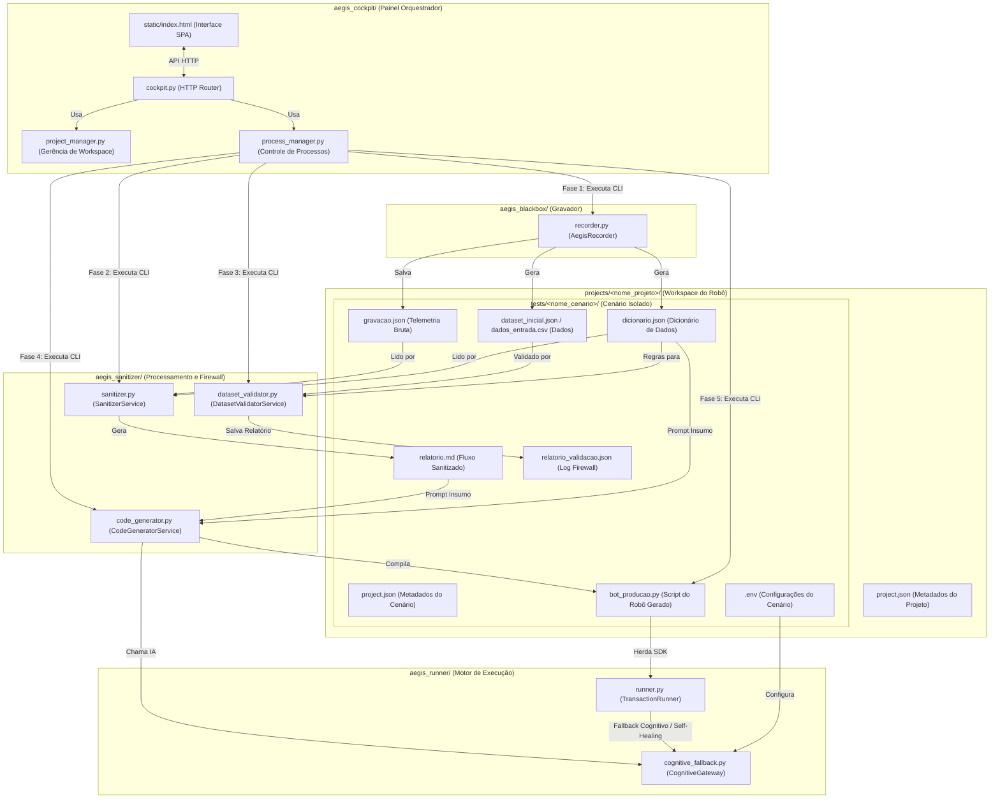

# 🛡️ Aegis RPA Suite: Guia de Instalação e Operação via Claude Code

O **Aegis RPA Suite** é um ecossistema portátil de desenvolvimento e resiliência de robôs RPA baseados em Python + Playwright. Este manual descreve como transferir, instalar e utilizar o framework em outro computador utilizando o **Claude Code** como assistente de codificação primário.

---

## 📂 Estrutura do Pacote Portátil

O projeto está estruturado de forma desacoplada seguindo a segregação de responsabilidades entre interface, orquestração física de projetos, gerenciamento de processos de background e lógicas de negócios:

```
aegis_rpa_suite/
├── .claude/
│   └── skills/                  # Skills locais ativadas no Claude Code
│       ├── rpa-copilot-analyst/ # Skill de Mapeamento & Diagnóstico
│       └── rpa-copilot-coder/   # Skill de Padrões de Resiliência (A-L)
├── aegis_blackbox/              # Gravador de Voo (BlackBox Recorder)
│   └── recorder.py              # Classe AegisRecorder para capturar eventos reativos
├── aegis_sanitizer/             # Compactador, Dicionário de Dados e Firewall
│   ├── sanitizer.py             # Classe SanitizerService (relatórios de telemetria)
│   ├── dataset_validator.py     # Classe DatasetValidatorService (firewall de dados)
│   └── code_generator.py        # Classe CodeGeneratorService (geração cognitiva via IA)
├── aegis_runner/                # Camada e helpers de execução resiliente
│   ├── runner.py                # TransactionRunner com suporte a injeção do gateway
│   └── cognitive_fallback.py    # Gateway cognitivo (LiteLLM/OpenRouter)
├── aegis_cockpit/               # Painel gráfico orquestrador e managers
│   ├── cockpit.py               # Entrypoint HTTP do servidor Cockpit
│   ├── project_manager.py       # Classe ProjectManager (gerência do workspace)
│   ├── process_manager.py       # Classe ProcessManager (controle assíncrono de processos)
│   └── static/                  # Frontend estático da interface SPA
│       └── index.html           # UI do Cockpit (HTML/CSS/JS segregado)
├── projects/                    # [Área Externa] Pasta de RPAs específicos
│   ├── control_center/          # Script e simuladores do Control Center
│   └── portal_segura_teste/     # Projeto de Testes com múltiplos cenários
│       ├── project.json         # Metadados do Projeto
│       └── tests/               # Subdiretório contendo cenários isolados
│           ├── cenario_principal/ # Cenário 1 (dataset, bot, dicionário, logs)
│           └── cenario_erro/    # Cenário 2 (dataset, bot, dicionário, logs)
├── telemetry_data/              # [Área Externa] Logs de telemetria e datasets
├── requirements.txt             # Dependências Python do ecossistema
└── README.md                    # Este manual de operação
```

### 🗺️ Mapeamento Arquitetural e Fluxo de Dados

Abaixo, o grafo demonstra como os arquivos e componentes interagem ao longo do ciclo de vida das 5 fases de desenvolvimento e execução do Aegis:



---

## 🌐 Integração com Playwright CLI

Embora o ecossistema Aegis utilize a API programática síncrona do Playwright em runtime (para garantir resiliência e hooks de Self-Healing com IA), o ambiente dispõe de utilitários do Playwright CLI para acelerar o setup e o desenvolvimento:

1. **Instalação Simplificada de Navegadores:**
   No **Aegis Cockpit**, você pode instalar todos os navegadores requeridos clicando no botão **🌐 Playwright Install** no topo da página. O terminal do painel exibirá o progresso em tempo real da execução do CLI.
2. **Gerador de Código Auxiliar (Codegen):**
   Caso precise mapear uma tela de forma rápida sem iniciar o gravador completo do BlackBox, execute o utilitário auxiliar de design-time:
   ```powershell
   python scratch/run_codegen.py --url "http://localhost:5173" --browser chromium
   ```

---

## 🔒 Regras de Isolamento de RPAs e Proteção do Framework (Aegis Blindado)

Para garantir a portabilidade do core da suíte Aegis, a manutenção do framework e a governança de credenciais, é mandatório seguir estas diretrizes:

1. **Não Geração de Arquivos na Raiz:** Não devem ser gerados arquivos na raiz do projeto (como screenshots, relatórios ou CSVs temporários), exceto em casos de extrema necessidade técnica.
2. **Isolamento de Diretórios de Processos (Projects):** Todos os scripts, simuladores, testes e logs específicos de um sistema alvo (como o Portal Segura) devem ficar confinados exclusivamente sob subpastas de `projects/` (ex: `projects/portal_segura_integracao_e2e/`), nunca dentro de pastas internas do Aegis.
3. **Core Framework Blindado:** A estrutura de pastas internas do Aegis (`aegis_runner`, `aegis_blackbox`, `aegis_cockpit`, `aegis_sanitizer`, `aegis_mentor`) é um motor de execução genérico e blindado. Nenhuma modificação específica de robôs ou arquivos de processos deve entrar nestas pastas.
4. **Desacoplamento de `projects/` e `telemetry_data/`:** As pastas `projects/` (onde residem os robôs) e `telemetry_data/` (onde residem os dados de input e logs de execução) devem ser tratadas como áreas completamente externas à suite core do Aegis, mantendo o framework 100% reutilizável e desacoplado.
5. **Múltiplos Cenários de Teste por Projeto:** Um único projeto (sistema/site alvo) pode agrupar múltiplos cenários de teste independentes (ex: Login com Sucesso, Login com Erro). Cada cenário é isolado em um subdiretório `tests/<slug_cenario>/` dentro do projeto, contendo suas próprias telemetrias, datasets, scripts gerados, arquivos `.env` e relatórios de execução.

---

## 🚀 Guia de Instalação em outro Computador

### Passo 1: Descompactar o Framework
1. Transfira o arquivo `aegis_rpa_suite.zip` para a máquina de destino.
2. Extraia o conteúdo em um diretório de trabalho de sua preferência (ex: `C:\workspace\aegis_rpa_suite`).

### Passo 2: Configurar o Ambiente Python
Abra o terminal do sistema (PowerShell ou CMD) e crie um ambiente virtual dedicado:
```powershell
cd C:\workspace\aegis_rpa_suite

# Criar ambiente virtual
python -m venv .venv

# Ativar ambiente virtual
.venv\Scripts\activate

# Instalar dependências e navegadores Playwright
pip install -r requirements.txt
playwright install chromium
```

### Passo 3: Iniciar o Claude Code
Certifique-se de ter o Claude Code CLI instalado globalmente na máquina (`npm install -g @anthropic-ai/claude-code`).
Navegue até a pasta do projeto e inicie a ferramenta:
```powershell
cd C:\workspace\aegis_rpa_suite
claude
```
> [!NOTE]
> Ao iniciar o Claude Code dentro da pasta raiz do projeto, ele lerá e ativará automaticamente as skills locais declaradas em `.claude/skills/rpa-copilot-analyst/SKILL.md` e `.claude/skills/rpa-copilot-coder/SKILL.md` com base nos metadados de YAML frontmatter, sem necessidade de configuração adicional.

---

## 🕹️ Aegis Cockpit (Painel Orquestrador)

O **Aegis Cockpit** centraliza a gestão dos projetos e cenários de testes, permitindo gravar, sanitizar, validar e executar robôs a partir de uma interface web interativa.

### Como Executar
Navegue até a pasta do projeto e inicie o servidor (ele carregará o ambiente padrão):
```powershell
python aegis_cockpit/cockpit.py
```

### Configurações de Porta e Workspace
As configurações globais do Cockpit são salvas no arquivo `aegis_config.json` localizado na raiz do projeto:
- **`port`**: Define a porta padrão do servidor (ex: `8075`). Se não estiver configurado ou se a porta estiver ocupada, o servidor tentará alocar portas sequenciais a partir de `8080`.
- **`projects_dir`**: O caminho absoluto para a pasta onde os projetos RPA estão localizados.
- **`telemetry_dir`**: O caminho para os arquivos de log centrais.

Exemplo de `aegis_config.json`:
```json
{
    "projects_dir": "C:\\Projetos\\aegis_rpa_suite\\projects",
    "telemetry_dir": "C:\\Projetos\\aegis_rpa_suite\\telemetry_data",
    "port": 8075
}
```

### 🖥️ Fluxo de Navegação Dual-State (Usabilidade Otimizada)
O Cockpit conta com uma arquitetura de navegação moderna dividida em dois ambientes principais para otimizar o fluxo de trabalho e evitar poluição visual:
1. **Portal de Projetos (Visão Global):** Uma tela inicial limpa que exibe todos os projetos RPA do seu workspace em formato de grid responsivo, permitindo pesquisar projetos por nome/URL em tempo real, configurar o diretório do workspace e criar novos projetos de forma simplificada.
2. **Workspace do Projeto (Visão Detalhada):** Ao selecionar um projeto, a interface foca exclusivamente nele. A barra lateral esquerda passa a gerenciar apenas os cenários de teste vinculados àquele projeto específico (incluindo criação e exclusão rápida) e oferece um botão `← Voltar para Projetos` para fácil retorno à tela inicial global. Os painéis de execução e visualizadores são mostrados no centro e direita focando no cenário selecionado.

### 🤖 Acompanhamento e Auditoria de Passos (Tempo Real)
O Cockpit conta com uma aba dedicada de **Passos** (na barra lateral direita) que permite acompanhar e auditar a execução do robô linha por linha:

* **Mapeamento Prévio**: O painel carrega a lista de eventos pré-gravados em `gravacao.json` para exibir o plano de execução planejado.
* **Status em Runtime**: Conforme as ações ocorrem no navegador, o painel do Cockpit consome a stream de logs e atualiza o grid dinamicamente:
  - `⏳ Executando` (azul com pulso): Destaca a ação atual do robô.
  - `✓ Sucesso` (verde): Ação concluída com sucesso.
  - `✨ Healed` (gradiente roxo): Seletor falhou originalmente, mas o robô se recuperou via Inteligência Artificial (Self-Healing).
  - `❌ Falhou` (vermelho): O passo falhou e abortou (com descrição detalhada do erro acessível ao posicionar o ponteiro do mouse sobre o campo correspondente).
  - `⏹ Parado` (laranja): O robô parou ou foi interrompido antes do passo ser executado.
* **Trilha de Auditoria Persistida**: Ao final de cada execução, o estado detalhado do grid é postado e gravado no arquivo `historico_passos.json` dentro do diretório do cenário. Isso mantém o histórico da última execução visível mesmo após recarregar a página ou reabrir o Cockpit.
* **Zerar Status**: Permite redefinir os passos de volta ao estado original `Pendente` e remover o histórico salvo no servidor.

---

## 🔄 Fluxo de Desenvolvimento Resiliente (Aegis Pipeline)

O ciclo de vida de um robô no ecossistema Aegis baseia-se em 5 Fases integradas que podem ser acionadas via CLI ou diretamente pelo painel gráfico **Aegis Cockpit** (que agora conta com um grid moderno responsivo e suporte a todas as etapas de orquestração):

### 1. Fase 1: Gravação (Aegis BlackBox)
Inicie o gravador apontando para o portal alvo (CLI ou Cockpit):
```powershell
python aegis_blackbox/recorder.py --url "https://mestres.ai" --output-dir "projects/seu_projeto" --control-port 9900
```
* **Operação Manual**: Pilote o fluxo manual completo na janela do navegador. O gravador interceptará APIs e registrará de forma nativa inputs comuns, calendários e upload de arquivos.
* **Operação Automática (Auto-Simulação)**: Para testes E2E completos e autônomos no Portal Segura, é possível rodar o fluxo simulado usando a flag `--auto-simulate`:
  ```powershell
  python aegis_blackbox/recorder.py --url "http://localhost:5173/?e2e=true" --output-dir "projects/portal_segura_teste" --auto-simulate
  ```
* **DOM Scanner (Varredura Periódica) & Anti-Bot**: O gravador injeta um script que varre ativamente o DOM a cada 3 segundos. Isso garante que todos os campos das telas (sejam preenchidos manualmente pelo operador ou automaticamente por APIs da SPA) sejam catalogados de forma semântica estável e resiliente contra IDs voláteis e dinâmicos do Angular Material. Adicionalmente, detecta campos com listeners de teclado (`keydown`/`keyup`) para configurar a estratégia de preenchimento `"fill_strategy": "HUMAN_LIKE"`, blindando contra exceções no carregamento de bibliotecas externas (ex: Zone.js).
* **Priorização do `data-testid`**: O motor de geração de seletores prioriza nativamente atributos de testes estruturados (`data-testid`, `data-test-id`, `data-test`, `data-qa`). Elementos genéricos sem identificador que possuam ancestrais com `data-testid` geram seletores estáveis baseados em retropropagação (ex: `[data-testid='parent-div'] >> span`).
* **Auditoria de Confiabilidade de Seletores**: O gravador executa uma análise heurística de confiabilidade de cada seletor gerado (scores de 0 a 100%). Seletores com confiabilidade crítica (< 70%) disparam alertas verbosos instantâneos no console do terminal (`[⚠️ AEGIS RECORDER ALERT]`) para alertar o desenvolvedor sobre a necessidade de incluir `data-testid` no elemento.
* **Graceful Shutdown**: Quando interrompido via Cockpit, o sistema tenta primeiro uma finalização limpa e síncrona enviando uma requisição HTTP para a API de controle do gravador (`/api/finish` na porta configurada, por padrão `9900`), garantindo que o dicionário e telemetrias pendentes no cache cooperativo sejam salvos em disco mesmo sob interrupções.

### 2. Fase 2: Sanitização/Tratamento (Aegis Sanitizer)
Condensa a telemetria bruta em memória e gera o dicionário de dados estruturado:
```powershell
python aegis_sanitizer/sanitizer.py --project-dir projects/seu_projeto
```
* **Gera**:
  * `relatorio.md` (sequenciamento consolidado de interações, tabelas de auditoria de confiabilidade com badges de status de seletores e avisos preventivos de baixo score).
  * `dicionario.json` (dicionário estruturado mapeando chaves semânticas, seletores, regexes de validação e pontuações de confiabilidade).
  * `dataset_inicial.json` (template de primeira linha de carga para o bot).
  * `template.csv` e `requirements.txt`.

### 3. Fase 3: Validação de Dataset (Firewall Validator)
Valida o seu arquivo de entrada de dados (CSV ou JSON) contra o dicionário de dados estruturado para assegurar conformidade técnica antes da execução em lote:
```powershell
python aegis_sanitizer/dataset_validator.py --dataset projects/seu_projeto/dataset_inicial.json --project-dir projects/seu_projeto
```
* **Validação Tolerante / Não-Bloqueante:** O validador não impede a execução do robô caso existam apenas inconsistências nos campos do formulário (ex: regex falho ou dados vazios). O bloqueio físico do pipeline e a marcação de falha no projeto (`validation_failed`) ocorrem apenas em casos de **Erros Críticos** estruturais da fila (como a ausência de `id` ou especificação de um `aegis_scenario` inexistente/não cadastrado no dicionário).
* **Análise de Intencionalidade por `expected_result`:**
  * **Avisos de Erro Esperados (Caminhos Alternativos):** Se o registro possuir o campo `expected_result` configurado como `"error"`, `"fail"`, `"failure"`, `"incorrect"` ou `"invalid"`, qualquer inconsistência de campos de dados é reportada de forma amigável no console (`[⚠️ AEGIS VALIDATOR WARNING]`), indicando um caso de teste intencional de erro que o robô deve processar no sistema de destino.
  * **Alertas de Risco de Quebra (Inesperados):** Se o registro for marcado com `expected_result = "success"` (ou nulo/vazio) mas contiver inconsistências de validação física, é emitido um alerta crítico no terminal (`[🔥 AEGIS VALIDATOR ALERT]`), notificando que há alto risco de quebra em produção ou resultado inesperado.
* **Geração de Logs e Relatório:** Salva um relatório estruturado em `relatorio_validacao.json` listando separadamente os blocos `"failures"` (erros críticos de orquestração) e `"warnings"` (avisos de validação de dados de campos, indicando se o erro era esperado ou não). Se não houver erros críticos, altera o status do projeto no `project.json` para `"validated"`.

### 4. Fase 4: Geração Automática de Código (Aegis Code Generator)
Compila de forma inteligente o script do robô utilizando IA (LiteLLM/OpenRouter) a partir do dicionário de dados e do relatório de telemetria. Esta fase pode ser disparada diretamente pela Cockpit através do botão **"Gerar Robô"**, atualizando o status do projeto para **Gerado** (`generated`):
```powershell
python aegis_sanitizer/code_generator.py --project-dir projects/seu_projeto
```
* **Requisitos:** Este módulo requer que o `.env` na pasta do projeto esteja configurado com as chaves e modelo de IA (como `AEGIS_COGNITIVE_API_KEY`, `AEGIS_COGNITIVE_PROVIDER` e `AEGIS_COGNITIVE_MODEL`).
* **Validação Sintática:** O gerador compila o script gerado em memória usando `compile()` antes de salvá-lo em `bot_producao.py`. Qualquer falha técnica ou truncamento de resposta impede a gravação e bloqueia o status do projeto.

### 5. Fase 5: Execução de Produção (Aegis Runner)
Executa a rotina em lote carregando o dataset higienizado e iniciando as transações:
```powershell
python projects/seu_projeto/bot_producao.py
```

---

## 🛠️ Mecanismos de Resiliência Nativos (Aegis Runner)

O **Aegis Runner** (`aegis_runner/runner.py`) implementa algoritmos de resiliência de alto nível para lidar com as principais falhas de automação web em ambientes dinâmicos e SPAs (Single Page Applications):

1. **Priorização de `data-testid` e Normalização:**
   * O framework incentiva e prioriza nativamente interações com seletores estruturados de teste (`data-testid`), isolando o robô de variações e IDs dinâmicos de backend.

2. **Preenchimento Resiliente de Texto (`fill_resilient`):**
   * De forma análoga aos cliques, o método `runner.fill_resilient()` executa preenchimentos determinísticos estáveis. Se o seletor falhar, o método tenta de forma reativa localizá-lo e aplicar a digitação via simulação de teclado físico (controlando foco e eventos Zone.js).

3. **Fallback Visual Cognitivo por Imagem (Último Caso):**
   * Se os seletores estáticos do Playwright (mesmo `data-testid`) falharem devido a alterações graves de layout ou quebras na estrutura da página, o Aegis Runner captura um screenshot da viewport atual e dispara uma chamada cognitiva de visão para a IA (Gemini).
   * A IA interpreta a imagem, localiza o elemento descrito semanticamente na tela, calcula suas coordenadas percentuais dinâmicas (independentes da escala da janela ou resolução da tela) e executa o clique físico do mouse no local preciso.

4. **Heurística Estática de Links (Priorização de Alvos):**
   * Ao invocar `runner.click_resilient()`, se múltiplos elementos corresponderem ao seletor (ambiguidade), o SDK lê dinamicamente as propriedades `href` de cada candidato com um timeout restrito de `500ms`.
   * Elementos com links âncora (que iniciam com `#`) são despriorizados, dando preferência absoluta a botões com links de navegação externa ou checkouts reais (`http/https`).

5. **Validação Ativa de Transição (State Verification):**
   * Quando o clique é acionado com `validate_navigation=True`, o SDK captura a URL atual e valida se o clique físico resultou em alteração de tela.
   * **Ignorância Instantânea de Elementos Ocultos:** Usa `is_visible()` em milissegundos para pular elementos invisíveis do DOM sem esperar o timeout padrão do Playwright.
   * **Redirecionamento Forçado de Segurança (Fallback):** Se o clique físico for ignorado pelo navegador (lags de binding de scripts em construtores como Elementor/WordPress) e a URL não mudar após 3 segundos, o SDK tenta de forma resiliente clicar nos demais candidatos sequencialmente. Caso todos falhem, extrai o link absoluto do elemento e força a navegação direta via `page.goto()`.
