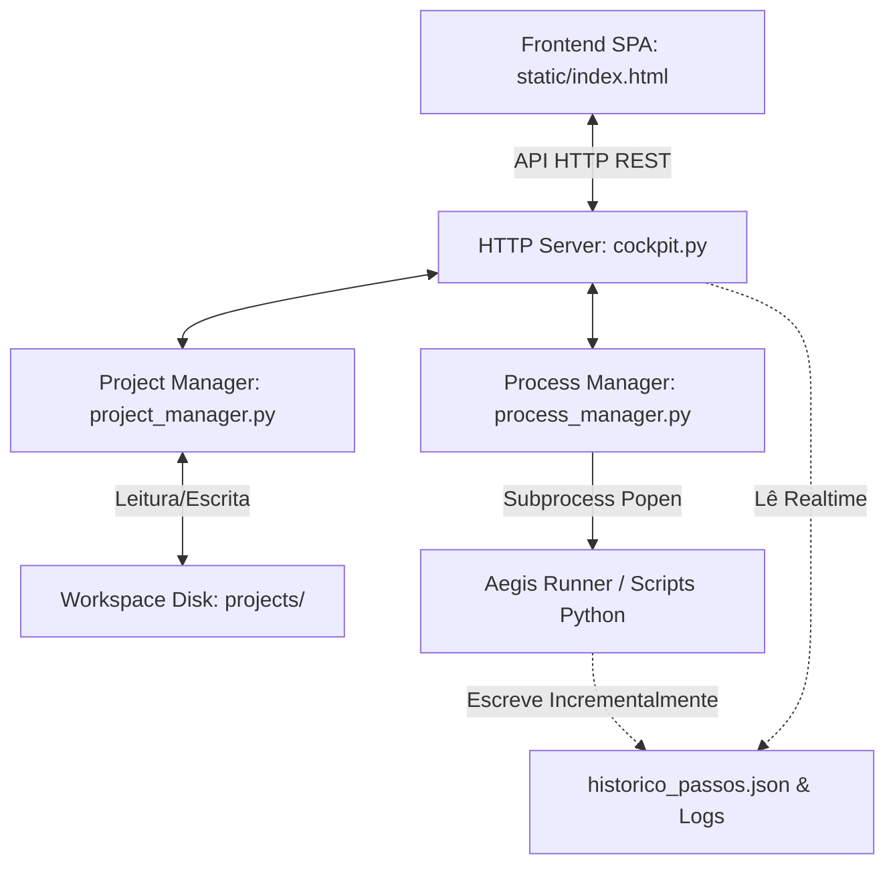

# 🛡️ Aegis Cockpit — Manual de Arquitetura e Especificação Técnica

O **Aegis Cockpit** é o console central de gerenciamento, orquestração e monitoramento do **Aegis RPA Suite**. Ele atua como uma interface gráfica e API de controle que integra e coordena as diferentes etapas do pipeline de automação (gravação de telemetria, sanitização, validação de dados, geração de código e execução de robôs com suporte cognitivo e self-healing).

Este manual destina-se a **arquitetos de soluções** e **desenvolvedores** que necessitam entender a arquitetura interna, os fluxos de dados, a API REST e os mecanismos de controle física/lógica do módulo `aegis_cockpit`.

---

## 1. Visão Geral do Sistema

O Aegis Cockpit centraliza o ciclo de vida de automações baseadas em transações no framework Aegis. Suas principais atribuições funcionais são:

1. **Gestão de Workspaces e Projetos:** Criação e isolamento físico de projetos RPA e múltiplos cenários de testes independentes.
2. **Orquestração do Pipeline:** Controle de execução de processos secundários do ciclo de vida:
   * **Gravação (`aegis_blackbox.recorder`):** Captura interações no navegador em tempo real.
   * **Sanitização (`aegis_sanitizer.sanitizer`):** Geração do dicionário semântico e relatórios higienizados de passos.
   * **Validação (`aegis_sanitizer.dataset_validator`):** Validação de datasets estruturados frente às especificações do dicionário.
   * **Geração de Código (`aegis_code_generator.code_generator`):** Criação ou correção cirúrgica do robô Playwright de produção.
   * **Execução do Robô:** Execução controlada em background monitorando logs, capturando screenshots de erros e gerando relatórios de transação.
3. **Mecanismo de Snapshots e Versões:** Registro histórico de versões (código e metadados) do robô para rollback ou duplicação.
4. **Painel de Triagem e Feedback do Ralph Loop (Self-Healing):** Interface para o Analista de QA auditar as tentativas de autocorreção propostas pela IA (seletores resilientes sugeridos pós-timeout), permitindo aprovar, recusar ou enriquecer correções pendentes.

---

## 2. Arquitetura de Componentes

O módulo adota uma arquitetura desacoplada na qual a persistência é baseada no sistema de arquivos local (`JSON` e `CSV`), garantindo portabilidade total do workspace e dispensando dependências de infraestrutura de banco de dados.



### Componentes Internos:

* **`cockpit.py`:** Servidor HTTP multithread que implementa os endpoints REST da aplicação e serve o frontend estático.
* **`project_manager.py`:** Módulo de controle do ciclo de vida de projetos. Manipula a criação de pastas, geração de arquivos de template (como `.env`, `requirements.txt`), versionamento de diretórios (snapshots) e migração de dados legados.
* **`process_manager.py`:** Gerenciador assíncrono de subprocessos. Executa os scripts Python da suíte em background de forma thread-safe, capturando a saída cumulativa e agindo de forma condicional conforme os códigos de saída (`exit codes`).
* **`static/index.html`:** Camada de frontend SPA (Single Page Application) autocontida, responsável por renderizar a interface gráfica e interagir com as rotas de API.

---

## 3. Especificação Técnica dos Módulos

### 3.1. Servidor HTTP e Rotas de API (`cockpit.py`)

O servidor do Cockpit é baseado em `BaseHTTPRequestHandler` com o servidor `ThreadingHTTPServer` (derivado de `ThreadingTCPServer` e `HTTPServer`). Isso permite concorrência no atendimento de requisições de polling de logs em tempo real sem bloquear outras interações da interface.

#### Mecanismo de Porta Adaptativa (`start_server`):
Ao inicializar, o Cockpit tenta escutar na porta padrão definida nas configurações (via `aegis_config.json` ou argumento de CLI `--port`). Em caso de colisão de porta (`OSError`), o servidor automaticamente incrementa a porta (`port += 1`) por até 10 tentativas para evitar falhas de inicialização do painel.

#### Endpoints da API REST (Resumo Técnico):

| Método | Rota | Descrição | Payload (Entrada) | Resposta (Sucesso) |
| :--- | :--- | :--- | :--- | :--- |
| **GET** | `/api/status` | Retorna o status atual do orquestrador de subprocessos. | N/A | `{"status": "IDLE", "running": false}` |
| **GET** | `/api/logs` | Retorna uma fatia dos logs em execução a partir de um `offset`. | Parâmetro Query: `offset` | `{"lines": [...], "offset": 120, "running": true}` |
| **GET** | `/api/config` | Obtém os diretórios ativos de projetos e dados de telemetria. | N/A | `{"projects_dir": "...", "telemetry_dir": "..."}` |
| **GET** | `/api/projects` | Lista todos os projetos disponíveis e seus cenários. | N/A | `{"projects": [{"id": "1", "name": "...", "tests": [...]}]}` |
| **GET** | `/api/projects/<slug>/skills` | Lista as Skills parametrizadas cadastradas no projeto. | N/A | `{"skills": [...]}` |
| **GET** | `/api/projects/<slug>/devops-config` | Carrega configurações de CI/CD do projeto, ocultando segredos. | N/A | `{"success": true, "config": {"pat": "********"}, ...}` |
| **GET** | `/api/projects/<slug>/telemetry-files` | Carrega o dicionário, o dataset, relatórios e o histórico de passos. | Parâmetro Query: `test_slug`, `current_row_id` | `{"dictionary": {...}, "dataset": [...], "steps_history": [...]}` |
| **GET** | `/api/projects/<slug>/tests/<tslug>/versions` | Lista os snapshots de versões do cenário de teste. | N/A | `{"versions": [{"id": "v1", "name": "..."}]}` |
| **GET** | `/api/projects/<slug>/tests/<tslug>/executions`| Lista o histórico de execuções passadas do cenário. | N/A | `{"executions": [...]}` |
| **GET** | `/api/projects/<slug>/tests/<tslug>/executions/<eid>` | Obtém o log técnico, histórico detalhado de passos e CSV final de uma execução. | N/A | `{"log": "...", "steps_history": [...], "report": [...]}` |
| **GET** | `/api/projects/<slug>/tests/<tslug>/executions/<eid>/files/<path>` | Serve arquivos gerados em execuções passadas (ex.: screenshots de erro). | N/A | Retorno binário (PNG, JPG, etc.) |
| **GET** | `/api/projects/<slug>/tests/<tslug>/execution-insights` | Carrega os insights e diagnósticos da IA sobre transações falhas da última execução. | N/A | `{"success": true, "insights": [{"transaction_id": "1", ...}]}` |
| **POST** | `/api/config` | Altera e persiste os diretórios padrão do Cockpit. | `{"projects_dir": "..."}` | `{"success": true, ...}` |
| **POST** | `/api/projects` | Cria um novo projeto físico no disco com templates. | `{"name": "...", "url": "...", "llm_api_key": "..."}` | `{"success": true, "project": {...}}` |
| **POST** | `/api/projects/<slug>/tests` | Adiciona um cenário de teste ao projeto. | `{"name": "...", "url": "..."}` | `{"success": true, "test": {...}}` |
| **POST** | `/api/projects/<slug>/skills/promote` | Promove um cenário de teste para Skill reutilizável. | `{"test_slug": "...", "skill_name": "..."}` | `{"success": true, "skill": {...}}` |
| **POST** | `/api/projects/<slug>/steps-history` | Atualiza o histórico de passos do cenário, filtrando e sincronizando a gravação. | `{"test_slug": "...", "steps": [...]}` | `{"success": true}` |
| **POST** | `/api/projects/<slug>/enrich` | Usa LLM para detalhar as descrições de negócio do projeto. | `{"name": "...", "business_description": "..."}` | `{"success": true, "enriched": {...}}` |
| **POST** | `/api/run-recorder` | Inicia o gravador de telemetria Playwright. | `{"project_slug": "...", "url": "..."}` | `{"success": true, "message": "..."}` |
| **POST** | `/api/run-sanitizer` | Inicia o higienizador de gravações. | `{"project_slug": "...", "test_slug": "..."}` | `{"success": true}` |
| **POST** | `/api/run-code-generator` | Aciona o gerador de código do robô. | `{"project_slug": "...", "test_slug": "..."}` | `{"success": true}` |
| **POST** | `/api/run-bot` | Inicia a execução do robô de produção em background. | `{"project_slug": "...", "headless": true, ...}` | `{"success": true, "execution_id": "..."}` |
| **POST** | `/api/stop` | Interrompe de forma controlada ou forçada o processo ativo. | N/A | `{"success": true}` |
| **POST** | `/api/projects/<slug>/tests/<tslug>/versions/<vid>/restore` | Efetua o restore do snapshot de versão selecionado. | N/A | `{"success": true}` |
| **POST** | `/api/projects/<slug>/tests/<tslug>/execution-insights/approve` | Salva na fila de correções as propostas de seletores aprovadas pelo QA. | `{"execution_id": "...", "corrections": [...]}` | `{"success": true}` |
| **POST** | `/api/projects/<slug>/tests/<tslug>/steps/<step_id>/mark-failed` | Permite ao QA sinalizar manualmente um passo como falho gerando correção pendente. | `{"description": "..."}` | `{"success": true, "correction_id": "..."}` |

---

### 3.2. Gerenciamento de Projetos e Versionamento (`project_manager.py`)

O `ProjectManager` é o responsável direto pelo ciclo de vida lógico e físico das estruturas no disco local.

#### 1. Estrutura de Diretórios Gerada
Ao criar um projeto e cenários de teste, o `ProjectManager` monta a seguinte topologia de pastas:

```
projects_dir/
└── {project_slug}/
    ├── project.json              <-- Metadados de identificação do projeto
    ├── .env                      <-- Arquivo de ambiente (Chave LLM, SlowMo, Headless)
    ├── requirements.txt          <-- Dependências locais e link do Wheel do Aegis
    ├── mentor_prompt.md          <-- Prompt gerador do robô para uso com o Mentor
    ├── DEVELOPMENT_GUIDE.md      <-- Guia de boas práticas RPA da suíte
    ├── devops_config.json        <-- Parâmetros do pipeline CI/CD
    ├── dist/
    │   └── *.whl                 <-- Cópia do pacote compilado do Aegis RPA Suite
    ├── skills/                   <-- Módulos reutilizáveis promovidos (Skills)
    │   └── {skill_slug}/
    │       ├── skill.json
    │       ├── gravacao.json
    │       └── dicionario.json
    └── tests/
        └── {test_slug}/          <-- Diretório ativo de desenvolvimento do Cenário
            ├── project.json      <-- Metadados do cenário (versão ativa, status)
            ├── gravacao.json      <-- Telemetria do Playwright Recorder
            ├── dicionario.json    <-- Dicionário de dados físico-semântico
            ├── dataset_inicial.json <-- Conjunto de dados em JSON
            ├── relatorio.md      <-- Relatório descritivo sanitizado
            ├── plano_execucao.json <-- Passos estruturados gerados pela sanitização
            ├── correcoes_acumuladas.json <-- Fila de correções de seletores (Ralph Loop)
            ├── code/
            │   ├── bot_producao.py <-- Script executável do Robô
            │   └── skills_lib.py  <-- Biblioteca auxiliar de importação de Skills
            ├── versions/
            │   └── {version_id}/  <-- Snapshots congelados (Cópia integral do cenário)
            └── executions/
                └── {execution_id}/ <-- Execuções arquivadas
                    ├── code/      <-- Snapshot do código exato executado nesta instância
                    ├── historico_passos.json <-- Histórico passo-a-passo
                    ├── reports/
                    │   ├── execution.log <-- Output cumulativo stdout/stderr
                    │   └── relatorio_execucao.csv <-- Status por registro de dados
                    └── screenshots/ <-- Prints em caso de falha técnica
```

#### 2. Controle de Snapshots de Versões
O versionamento de cenários permite isolar o desenvolvimento de rascunhos da versão de produção:
* **`create_version`:** Congela o diretório ativo do cenário sob `versions/{version_id}/`. Ele realiza a cópia de todos os artefatos de dados (`gravacao.json`, `dicionario.json`, `dataset_inicial.json`), scripts do diretório `code/`, documentações (`relatorio.md`) e screenshots.
* **`restore_version`:** Efetua o restore completo da versão desejada sobrepondo os arquivos ativos do teste. O método limpa de forma segura arquivos legados para evitar conflito de código de robôs anteriores.
* **`save_current_version`:** Caso o cenário esteja apontando para uma versão ativa congelada (que não o `draft` padrão), este método sobreescreve os arquivos do snapshot com as edições atuais em disco.

#### 3. Migração de Compatibilidade Automática
O `ProjectManager` detecta estruturas de projetos anteriores à arquitetura multi-cenários V2:
* **Migração de Telemetria (`migrate_legacy_if_needed`):** Caso existam telemetrias antigas soltas sob `telemetry_data/`, cria um projeto `exemplo_migrado` redistribuindo os arquivos em suas respectivas posições lógicas.
* **Reestruturação de Projetos Monolíticos (`migrate_legacy_project`):** Caso o diretório de um projeto possua arquivos de código e telemetria diretamente no root (antigo padrão monolítico), o Cockpit move esses arquivos para `tests/cenario_padrao/` e realoca scripts de automação para a pasta `code/`.

---

### 3.3. Orquestração e Monitoria de Processos (`process_manager.py`)

O `ProcessManager` gerencia a execução assíncrona de subprocessos do sistema operacional e unifica a saída de logs para exibição no dashboard.

#### Fluxo de Execução Assíncrona:
1. Um subprocesso é criado usando `subprocess.Popen` com redirecionamento de streams: `stdout=subprocess.PIPE` e `stderr=subprocess.STDOUT`.
2. O parâmetro `PYTHONPATH` do ambiente (`env`) é configurado automaticamente para incluir a raiz do projeto Aegis, garantindo a resolução correta de pacotes internos sem a necessidade de instalações adicionais no sistema global.
3. Uma thread de leitura de logs (`log_reader`) é disparada em paralelo, lendo a saída linha por linha.
4. Para garantir concorrência thread-safe nas operações de leitura e gravação cumulativa no buffer de memória (`self.global_logs`), utiliza-se o primitivo de sincronização `threading.Lock`.

#### Ações Pós-Processamento:
Ao detectar que o processo filho foi encerrado, a thread de monitoramento invoca rotinas baseadas na natureza do script finalizado:
* **Finalização de Gravação (`GRAVAÇÃO`):** Aciona o `ProjectManager` para criar automaticamente uma versão de snapshot segura (`auto_create_version_after_recording`) a partir da gravação efetuada.
* **Finalização de Robô (`EXECUÇÃO_ROBÔ`):**
  * Salva o log final cumulativo sob `reports/execution.log`.
  * Abre e analisa o arquivo de transações `relatorio_execucao.csv` para apurar estatísticas de sucesso (número de transações processadas com êxito vs falhas).
  * Atualiza o registro histórico em `executions.json`.
  * Atualiza o status do projeto ativo para `executed` caso o código de saída do processo (`exit_code`) seja `0`.

#### Encerramento Limpo vs Forçado (`stop_active_process`):
Processos como o Gravador de Telemetria retêm informações de eventos capturados em memória RAM. Finalizá-los abruptamente impede a correta gravação do arquivo de dados.
O Cockpit implementa um mecanismo de **Graceful Shutdown**:
* Se o processo ativo for `GRAVAÇÃO`, o Cockpit tenta abrir uma requisição HTTP interna para `http://localhost:9900/api/finish` (porta de controle do gravador de telemetria).
* O gravador intercepta o sinal, encerra o navegador, salva o arquivo `gravacao.json` em disco e finaliza voluntariamente em até 15 segundos.
* Se a requisição falhar ou o timeout estourar, o Cockpit aciona o encerramento do processo pelo sistema operacional (`process.terminate()`).

---

## 4. Fluxos de Integração e Ciclo de Self-Healing (Ralph Loop)

O Cockpit atua como o painel de aprovação humana no ciclo de autocorreção da IA (**Ralph Loop**):

```
[Execução do Robô] ──> Timeout/Erro no Seletor ──> [Self-Healing/Cognição]
                                                          │ (Propõe Seletor)
                                                          ▼
[Code Generator] <── Aprovado 1-Click <── [Aba Insights no Cockpit]
 (Aplica Correção)
```

1. **Captura do Incidente:** Durante a execução do robô de produção em background, se ocorrer um erro de seletor físico (ou mudança no DOM), o runner do Aegis tenta aplicar o Self-Healing com IA (usando os parâmetros do `.env`). Se a execução da transação mesmo assim falhar, o runner escreve a falha, a screenshot correspondente e o seletor problemático no CSV e nos logs.
2. **Triagem de Insights:** O desenvolvedor/QA acessa o painel de **Insights** do cenário. O Cockpit lê a última execução, processa o diagnóstico de IA no erro (`IA DIAGNOSE [TIPO_ERRO]: causa_raiz (Recomendação: correcao)`) e exibe de forma clara:
   * A screenshot do momento da quebra.
   * O seletor que falhou.
   * O diagnóstico estruturado e a proposta de correção da IA.
3. **Aprovação do QA:** O QA pode revisar, editar a proposta da IA e aprovar a correção com um único clique.
4. **Registro de Correções:** Ao aprovar, o Cockpit grava a correção com status `pending` e registra a chave do passo físico (`step_id`) no arquivo `correcoes_acumuladas.json`.
5. **Geração Cirúrgica de Código:** Quando o desenvolvedor aciona a geração de código (`POST /api/run-code-generator`), o `code_generator.py` carrega a lista de correções pendentes, correlaciona-as de forma cirúrgica com os blocos no `plano_execucao.json` e reescreve apenas as linhas do passo específico no arquivo `bot_producao.py` (evitando reescrever o arquivo inteiro e perder edições manuais). Ele altera o status da correção para `applied`.

---

## 5. Guia de Operação e Execução

### Requisitos Mínimos:
* Python 3.8 ou superior.
* Playwright configurado (`playwright install chromium msedge`).

### Como Iniciar o Cockpit:
Para iniciar o servidor local, execute o script a partir do diretório raiz da suíte:

```powershell
# Execução direta com porta padrão
python aegis_cockpit/cockpit.py

# Especificando uma porta alternativa
python aegis_cockpit/cockpit.py --port 8080
```

### Variáveis de Ambiente Recomendadas (Arquivo `.env` no Projeto):
Cada projeto possui seu arquivo `.env` para controle do comportamento do robô orquestrado pelo Cockpit:

* `AEGIS_BROWSER_HEADLESS`: Executa o browser em modo invisível (`true` ou `false`).
* `AEGIS_COGNITIVE_ENABLED`: Ativa a IA autoreparadora em caso de quebras de seletores (`true` ou `false`).
* `AEGIS_COGNITIVE_PROVIDER`: Provedor cognitivo (`openrouter`, `litellm` ou `gemini`).
* `AEGIS_COGNITIVE_MODEL`: Modelo da LLM a ser utilizado (ex.: `google/gemini-2.5-flash`).
* `AEGIS_COGNITIVE_API_KEY`: Token secreto de autenticação do provedor de IA.
* `AEGIS_COGNITIVE_BASE_URL`: Endpoint da API cognitiva.
