# 🛡️ Aegis Runner: Documentação Técnica e Funcional

Este documento descreve a arquitetura, o funcionamento interno e as diretrizes de integração do módulo **aegis_runner**, o componente de execução e resiliência do **Aegis RPA Suite**. É destinado a arquitetos de software e desenvolvedores de automação.

---

## 1. Visão Geral e Arquitetura

O **aegis_runner** é a biblioteca de execução do ecossistema Aegis. Seu principal objetivo é garantir que os robôs gerados executem com a máxima estabilidade possível, mesmo diante de instabilidades temporárias de rede, alterações no DOM da página web ou bloqueios de comportamento (anti-bots).

Para isso, o runner adota uma abordagem híbrida de resiliência baseada em duas camadas:
1. **Camada Determinística (Offline):** Execução ágil baseada em Playwright, provida de algoritmos matemáticos e heurísticas estruturais locais (ex: análise de classe de irmãos, reposicionamento CDK, ordenação de âncoras locais, etc.).
2. **Camada Cognitiva (Online - LLM):** Acionada dinamicamente como fallback quando a camada determinística falha, usando visão computacional multimodal para curar seletores e diagnosticar quebras funcionais.

> **Doutrina "Cauda Longa Verificada" (2026-07-15, `.specs/plano-cauda-longa-verificada.md`):** a régua deixou de ser "LLM sim ou não" e passou a ser "**verificado** sim ou não". Nenhum tier de recuperação — determinístico, geometria, coordenada gravada ou LLM — pode reportar `HEALED`/`SUCCESS` sem uma **pós-condição observável** (`_verify_action_effect`) confirmando que a ação teve o efeito esperado. O self-healing cognitivo (`self_healing_click`/`propose_fill_target`) deixou de clicar/digitar diretamente — ele só **propõe** uma coordenada; o runner decide se age (gate de plausibilidade pré-clique, `_hit_test_plausible`) e se aceita o resultado (verificação pós-ação). Isso vale também para os tiers que antes trocavam de alvo silenciosamente (heurística multi-candidato, `.first` em erro de múltiplos elementos) e para a coordenada gravada, que agora é verificada e roda **antes** do LLM (é a mesma categoria de `fallback_selectors`: caminho alternativo pro mesmo alvo gravado, não adivinhação). Ver Seções 2 e 3 abaixo, e Seção 2.E para a telemetria que audita essa doutrina.

```mermaid
graph TD
    A[Execução de Ação no Robô] --> B[Camada Determinística: Playwright]
    B -->|Sucesso Visual/Efeito Confirmado| C[Sucesso]
    B -->|Falha Técnica ou Sem Efeito| D[Recuperação Determinística: Escape/CDK/Fallback Selectors]
    D -->|Sucesso| C
    D -->|Falha em Modo Strict ou Flaky < 4| E[Lança FlakyStepFailure / Exceção]
    D -->|Falha Geral / Flaky >= 4| G3[Nível 3: Geometria DOM ao Vivo por Texto]
    G3 -->|Sucesso| C
    G3 -->|Não aplicável / Falha| G4[Nível 4: Coordenada Gravada + _verify_action_effect]
    G4 -->|Verificado| C
    G4 -->|VERIFY_REJECTED / strict=True| F[Nível 5: Camada Cognitiva - propõe, não age]
    F -->|Proposta plausível &#40;_hit_test_plausible&#41;| F2[Clique/foco físico]
    F -->|Implausível / strict=True| H[Falha Crítica do Passo]
    F2 -->|_verify_action_effect confirma| C
    F2 -->|VERIFY_REJECTED| H
```



> **Nota de ordenação (2026-07-15, revisa a nota de 2026-07-13):** a ordem final é geometria-ao-vivo (Nível 3) → **coordenada gravada verificada (Nível 4)** → **LLM proposto-e-verificado (Nível 5, antes "3.5")** → falha limpa. A coordenada gravada foi movida para ANTES do LLM porque, com verificação de efeito ativa, ela é um tier de identidade barato (mesmo alvo gravado, caminho alternativo) — não adivinhação — e só é insegura sem a ressalva de overlay do `_verify_action_effect` (uma coordenada obsoleta caindo no backdrop de um painel CDK muda os sinais genéricos "parecendo efeito real"; a ressalva exige pós-condição específica quando há painel aberto no snapshot anterior). Sob `strict=True`, a cadeia para no Nível 3 — nem coordenada nem LLM rodam (Seção 2.F).

### Arquitetura de Módulos e Componentes

- **[runner.py](file:///c:/Projetos/aegis_rpa_suite/aegis_runner/runner.py):** Contém a classe [TransactionRunner](file:///c:/Projetos/aegis_rpa_suite/aegis_runner/runner.py#L48), responsável pelo ciclo de vida da transação em lote, gerenciamento de dados de entrada, auditoria em tempo real, geração de relatórios e motor de interação resiliente com o browser.
- **[cognitive_fallback.py](file:///c:/Projetos/aegis_rpa_suite/aegis_runner/cognitive_fallback.py):** Contém a classe [CognitiveGateway](file:///c:/Projetos/aegis_rpa_suite/aegis_runner/cognitive_fallback.py#L8), responsável pelo isolamento de chaves `.env` do projeto e requisições à API de inteligência artificial de visão e processamento textual para self-healing e diagnose.
- **[verify_visual.py](file:///c:/Projetos/aegis_rpa_suite/aegis_runner/verify_visual.py):** Script utilitário executado na esteira CI/CD ou no Cockpit para homologar e comparar visualmente a interface gerada com a original do gravador.

---

## 2. O Motor de Interações Resilientes

O [TransactionRunner](file:///c:/Projetos/aegis_rpa_suite/aegis_runner/runner.py#L48) encapsula as interações com o Playwright através de wrappers inteligentes que implementam algoritmos de resiliência avançada.

### A. Cliques Resilientes ([click_resilient](file:///c:/Projetos/aegis_rpa_suite/aegis_runner/runner.py#L462))

A ação de clique físico padrão em automação é uma das maiores causas de quebras ("flakiness"). O método [click_resilient](file:///c:/Projetos/aegis_rpa_suite/aegis_runner/runner.py#L462) resolve essa volatilidade por meio de níveis progressivos:

0. **Espera pré-clique por elemento conhecidamente desabilitado (sensor `ENABLE_TIMEOUT`):** antes de qualquer tentativa física, `_wait_for_known_disabled_button` espera (timeout configurável, default 15s) até que o seletor-alvo saia do estado `disabled` — cobre botões gated por validação assíncrona (ex.: submit que só habilita após uma consulta de CPF terminar). Ver subseção D.
1. **Hover-to-Reveal Sequencial:** Se o seletor contiver o encadeamento de submenus (` >> `), o runner executa uma verificação rápida e realiza o `hover` recursivo em todos os elementos intermediários para garantir a expansão dinâmica dos submenus.
2. **Priorização de Âncoras Reais + Verificação de Ambiguidade (Heurística Estática, T1):** Ao identificar múltiplos candidatos que batem com o seletor, o runner inspeciona o atributo `href` — candidatos que não são âncoras locais (`href="#"`) recebem prioridade. **Quando há ambiguidade real (2+ candidatos visíveis)**, cada clique de candidato é verificado (`_verify_action_effect`, com snapshot antes/depois) antes de ser aceito — um candidato clicado sem efeito observável é descartado e o próximo é tentado. Resolução por ambiguidade verificada loga `HEALED`/`healing_method="ambiguous_candidate_verified"` (não mais `SUCCESS` silencioso) e registra `needs_review` (Sensor F1, Seção 4.B) — trocar de alvo entre candidatos ambíguos é uma decisão do framework, não fidelidade pura ao seletor gravado. A mesma regra vale para o fallback de "strict mode violation"/"resolved to" → `.first` (T2), tanto no clique quanto no preenchimento: só aceita o `.first` se o efeito for verificado; senão, propaga a falha original para o próximo nível de recuperação.
3. **Sensor de Falso-Sucesso (`CLICK_NO_EFFECT`):** Muitos portais capturam cliques através de overlays invisíveis, fazendo com que o Playwright reporte sucesso no clique físico, mas sem causar nenhuma alteração na tela. O runner resolve isso tirando um snapshot leve pré-clique (URL atual, tamanho do DOM, quantidade de overlays ativos e classe/atributos ARIA dos irmãos diretos do elemento) e comparando com o estado pós-clique. Se nada mudar em até 800ms, o clique é declarado sem efeito (`CLICK_NO_EFFECT`) e a mesma cadeia de recuperação determinística (Escape+retry → reposição CDK → `fallback_selectors`) é disparada **antes** de fechar o passo — só cai para cognitivo/coordenada se nenhuma delas produzir efeito real. Flag mestre `AEGIS_CLICK_EFFECT_SENSOR` (default `true`).
4. **Resiliência por Escape reativo:** O runner envia a tecla `Escape` à página para descartar overlays, loaders ou modais abertos no meio da transação e retenta o clique mecânico.
5. **Reposicionamento de Overlay CDK:** Se a falha for provocada por painéis flutuantes (como os overlays do Angular Material que estouram os limites do viewport), o runner injeta um script JavaScript no browser para reconfigurar as coordenadas de posicionamento de `.cdk-overlay-pane` (posicionando-o em local fixo e acessível) e injeta o clique através de um evento sintético.
6. **Seletores de Fallback Determinísticos (`fallback_selectors`):** Derivados do plano de execução do robô (gravados sequencialmente durante o voo de telemetria), o runner tenta, um a um, seletores alternativos e estáveis que também foram registrados para o mesmo passo.
7. **Nível 3 — Geometria DOM ao Vivo por Texto (`_click_by_live_geometry`):** quando o chamador fornece o texto vivo da opção-alvo (extraído do `has_text` literal do seletor via `click_chained`), o runner varre o DOM em tempo real procurando um elemento cujo texto bate, clicando pela geometria (`Bounding Rect`) atual — não pela coordenada gravada, que fica obsoleta assim que o painel reancora na posição viva do input. Roda **antes** do self-healing cognitivo (ver Nota de ordenação da Seção 1). Não se aplica a `click_resilient` puro (sem texto vivo disponível) — só a `click_chained`, cujo caso de uso são opções de painel/menu com texto conhecido.
8. **Nível 4 — Coordenada Gravada Verificada:** clica na coordenada relativa em que o elemento foi gravado originalmente (`original_coords`), captura snapshot antes/depois e só aceita via `_verify_action_effect`. Rejeitado (`[VERIFY_REJECTED]`) → cai pro Nível 5, nunca aborta a cadeia por conta própria. Sob `strict=True`, este tier nem roda — ver Seção 2.F. **Caso especial — host de Shadow DOM fechado** (`shadowrootmode="closed"`, validado ao vivo no Portal Segura st_054, 2026-07-15): nenhum seletor/query alcança o conteúdo interno (nem `>>`, nem `elementFromPoint`, nem `composedPath()` de clique real — todos retargetam pro host), então este tier é o único caminho viável. Quando `_is_closed_shadow_target` reconhece o padrão sob a coordenada (0 filhos, 0 texto no light DOM, área visível não-trivial, `target_description` mencionando "shadow"), ou `_snap_to_closed_shadow_host` acha o host num raio pequeno (corrige o viés sistemático de ~50px das coordenadas gravadas/propostas por visão), o clique único vira **sondagem multi-ponto verificada** (`_probe_closed_shadow_click`): bandas verticais do bbox real do host (ponto proposto → 75% → 50% → 25% → 87.5% da altura — o botão interno é invisível de fora e o centro geométrico pode cair num elemento interno inerte, confirmado ao vivo), cada candidata verificada individualmente via polling genérico ESTENDIDO (`_poll_generic_effect_extended`, ~6s — o efeito real É observável em light DOM, mas com latência de segundos acima da janela padrão do sensor). Nenhuma banda com efeito → `VERIFY_REJECTED`, nunca `HEALED` às cegas (a primeira versão aprovava incondicionalmente e produziu `HEALED` falso confirmado ao vivo, mascarando falhas em cascata nos passos seguintes).
9. **Nível 5 — Self-Healing Cognitivo por IA (propõe, não age):** último tier antes da falha. Se ativado e o passo não for restritivo, o runner captura um screenshot e delega à LLM (`self_healing_click`) a localização espacial do elemento — mas a LLM **só retorna uma proposta** (`{x, y, reason, confidence}` ou `None`, nunca clica). O runner então: (a) roda `_hit_test_plausible` (gate de plausibilidade pré-clique — `elementFromPoint` na coordenada proposta, compara com `target_description`; implausível → `VERIFY_REJECTED` pré-clique, **nenhuma ação física ocorre**, custo zero de efeito colateral); (b) se plausível, executa o clique/foco físico; (c) roda `_verify_action_effect` pós-ação; só então reporta `HEALED`/`healing_method="visual_ai"`. Propostas que caem sobre (ou perto de) um host de Shadow DOM fechado seguem o mesmo desvio de sondagem multi-ponto do Nível 4 (snap → `_probe_closed_shadow_click`) — o gate de texto de `_hit_test_plausible` não se aplica nesse caso porque o `textContent` do host não atravessa a fronteira do shadow. Ver Seção 3.B para o contrato completo do gateway.

> [!NOTE]
> **Shadow DOM Piercing:** O runner suporta cliques diretos dentro de Shadow Roots abertos usando o encadeamento nativo `>>`. Para Shadow Roots **fechados** (`shadowrootmode="closed"` — invisíveis a qualquer seletor ou query JS externa, sem sintaxe de piercing possível), o único caminho é clique físico por coordenada, e a cadeia de recuperação trata isso como caso de primeira classe: detecção do host via `_is_closed_shadow_target`, correção de coordenada via `_snap_to_closed_shadow_host` e sondagem multi-ponto verificada via `_probe_closed_shadow_click` (ver Nível 4 acima). O método bruto [click_by_coordinates](file:///c:/Projetos/aegis_rpa_suite/aegis_runner/runner.py#L1074) continua disponível para uso direto pelo código gerado.

### B. Entradas de Texto Resilientes ([fill_resilient](file:///c:/Projetos/aegis_rpa_suite/aegis_runner/runner.py#L1787))

O preenchimento de campos através de [fill_resilient](file:///c:/Projetos/aegis_rpa_suite/aegis_runner/runner.py#L1787) suporta duas estratégias fundamentais de entrega de caracteres:

1. **Estratégia `DIRECT`:** Executa o método `.fill()` nativo do Playwright. É extremamente rápida e recomendada para a maioria dos campos.
2. **Estratégia `HUMAN_LIKE` ([fill_human_like](file:///c:/Projetos/aegis_rpa_suite/aegis_runner/runner.py#L1902)):** Desenvolvida para contornar anti-bots comportamentais e scripts reativos de frameworks (Zone.js/Angular/React Hook Forms). Muitos campos calculam a cadência de digitação física. Digitações instantâneas fazem o portal invalidar o campo, mantendo botões de submissão desabilitados.
   - **Mecanismo:** Digita tecla por tecla enviando eventos de teclado com delay real (`time.sleep` entre 60ms e 100ms) bloqueando o processo. Isso simula a performance real do operador humano.
   - **Formatador de Datas:** Detecta se o campo não é um input nativo `type="date"` e realiza o parser automático de formato `yyyy-mm-dd` para o formato local `dd/mm/yyyy`.

> [!TIP]
> Campos sensíveis a cadastros (como Nome, CPF, CNPJ e Senha) devem sempre adotar a estratégia `HUMAN_LIKE` se houver validações dinâmicas de rede no portal alvo.

### C. Seleções em Dropdowns ([select_option_resilient](file:///c:/Projetos/aegis_rpa_suite/aegis_runner/runner.py#L1187))

A manipulação de campos dropdown não-nativos (como `<mat-select>` ou listas Bootstrap customizadas) é dividida em duas etapas robustas:

1. **Abertura do Painel (Trigger):** Tenta abrir o dropdown disparando cliques em seletores hierárquicos e de proximidade (ex: `label ~ div`).
   - **Tabelas de Grid Dinâmico:** Se múltiplas linhas de uma tabela compartilharem o mesmo texto e possuírem colunas idênticas (ex: tabela de coberturas de seguros com várias colunas de dropdowns), o runner localiza a linha exata `.mat-row` filtrando pelo rótulo do plano e infere a coluna correta (0: LMG, 1: Franquia, 2: Desconto) a partir da máscara de texto da opção informada (percentual, valores monetários ou textos chaves).
2. **Seleção da Opção:** Tenta clicar no item por meio de seletores como `[role='option']:has-text(...)` e `.mat-option:has-text(...)`.
   - **Geometria ao Vivo:** Se o dropdown não reabrir ou sumir do DOM virtual, o runner varre as dimensões de tela renderizadas procurando a coordenada de caixa (`Bounding Rect`) da opção textual exibida, disparando o clique por geometria de tela atualizada.

`_click_by_live_geometry` é compartilhado entre `select_option_resilient` e o Nível 3 de `click_chained` (Seção 2.A) — internamente tem dois sub-níveis: **Nível 1** (comportamento original, casamento por classe/role reconhecível, tentado sempre primeiro) e **Nível 2** (fallback adicional escopado a um container de overlay/painel genérico aberto, só tentado quando o Nível 1 não encontra nada — evita soltar um seletor `div` puro contra o documento inteiro).

### D. Sensor `ENABLE_TIMEOUT` — botões/elementos que só habilitam após validação assíncrona

Alguns cliques dependem de um alvo que só fica habilitado depois que uma validação assíncrona do lado da aplicação termina (ex.: um botão de submit gated numa consulta de CPF). Dois mecanismos cobrem isso, ambos operando sobre **qualquer seletor**, não uma lista fixa:

- **`_wait_for_known_disabled_button`** (pré-clique): espera até o seletor-alvo sair do estado `disabled`, timeout configurável (default 15s).
- **`_wait_if_wizard_transition_button`** (pós-clique): depois do clique físico, faz polling do estado de habilitação do mesmo seletor; a cada iteração também reavalia o snapshot do sensor `CLICK_NO_EFFECT` para diagnosticar se o clique já teve efeito enquanto espera.
- **`_recover_via_recent_fills`**: se o polling pós-clique estourar o timeout, o runner reproduz (na estratégia original de cada um) os preenchimentos recentes bufferizados em `self._recent_fills` (um `deque(maxlen=30)` alimentado só por `fill_resilient`, nunca limpo por-clique — o campo que precisa de replay pode estar vários passos atrás) e reavalia a habilitação uma vez. Cada entrada do buffer é presence-checked (`is_visible(timeout=500)`) antes do replay, para pular entradas obsoletas de uma tela já navegada em vez de pagar um timeout completo de `fill_resilient`.

Se mesmo assim o alvo nunca habilitar, o fluxo cai para a mesma decisão terminal (`strict`/cognitivo/coordenada) de qualquer outra falha de clique. Uma recuperação bem-sucedida por este sensor registra `needs_review` com `healing_method="enable_timeout_recovered"` — mesmo hook (`_register_healing_for_review`) usado por qualquer outro tier de cura, independente de o sensor `CLICK_NO_EFFECT` também ter disparado para o mesmo passo.

### E. Telemetria de Resolução por Tier

Aditivo ao histórico de execução (`historico_passos.json`), sem alterar o schema existente:

- **`resolver_tier`** por passo: reaproveita `healing_method` quando o passo curou (`"visual_ai"`, `"coordinate"`, `"ambiguous_candidate_verified"`, `"fallback_selector"`, `"parent_has_text_reduced"`, `"live_geometry_by_text"`, `"enable_timeout_recovered"`, `"click_no_effect_recovered"`); `"identity"` quando resolveu no seletor primário (`SUCCESS` direto); `None` quando não resolveu (`FAILED`/`STOPPED`).
- **`verify_result`** por passo curado: resumo do que `_verify_action_effect` avaliou — `{"kind": ..., "specific": bool, "passed": bool}` (`kind="generic"`/`specific=False` quando caiu nos sinais genéricos; `kind` concreto — `"fill"`, `"select"`, `"trigger_open"`, `"navigation"`, `"closed_shadow_click"` — quando avaliou pós-condição específica).
- **`VERIFY_REJECTED` pré vs. pós-clique:** contagem separada por execução — pré-clique é rejeição do gate de plausibilidade (nenhuma ação física ocorreu, custo zero); pós-clique é rejeição de `_verify_action_effect` depois que a ação já aconteceu.
- **`reports/telemetria_resolucao.json`** — gravado uma vez no fim do batch (`run()`): `tier_resolution_counts`/`tier_resolution_rate` (quanto da cauda longa cada tier realmente resolveu) e `verify_rejected_counts`/`verify_rejected_rate` (pré vs. pós). É o número que valida a adesão à doutrina — alta taxa de `identity` e baixa de `visual_ai`/coordenada indica que o caminho feliz determinístico está saudável; alta taxa de rejeição pós-clique indica que o self-healing está "quase acertando" mas a pós-condição não bate (vale investigar o `expected_effect` do prompt).

### F. Semântica de `strict`

`strict=False` é o default de produção em todos os métodos resilientes — a cadeia completa (identidade → geometria → coordenada verificada → LLM proposto-e-verificado) fica disponível. `strict=True` restringe a cadeia a **apenas os tiers 1-2** (seletor primário + identidade/geometria/`fallback_selectors`) — sem coordenada gravada, sem LLM. É o modo de homologação/replay-literal: falha rápido e limpo em vez de tentar adivinhar, útil pra validar que o seletor primário/gravado realmente resolve sem depender de nenhum tier de recuperação. Composição com a mecânica `flaky` (Seção 4.A) é preservada: o gate `(strict or is_flaky_step) and not flaky_healing_unlocked` é avaliado ANTES de qualquer tier de recuperação — um passo `flaky` na 4ª tentativa da linha ainda desbloqueia coordenada/LLM mesmo sob `strict=True` (a mecânica de retry por linha tem prioridade sobre o modo homologação).

---

## 3. A Camada Cognitiva

O [CognitiveGateway](file:///c:/Projetos/aegis_rpa_suite/aegis_runner/cognitive_fallback.py#L8) gerencia toda a comunicação com LLMs multimodais para contornar problemas imprevisíveis de interface.

### A. Integração com Provedores
O gateway autocarrega chaves de API e configurações declaradas tanto na raiz do framework quanto isoladamente na pasta de execução do robô específico. Aceita os provedores `openrouter` (usando o endpoint de completions) ou qualquer provedor local compatível com a biblioteca LiteLLM (através de `http://localhost:4000/v1`).

### B. Auto-Healing Visual — Proposta, não Ação ([self_healing_click](file:///c:/Projetos/aegis_rpa_suite/aegis_runner/cognitive_fallback.py#L247) / `propose_fill_target`)

> **Contrato mudou em 2026-07-15 (doutrina "Cauda Longa Verificada"):** `self_healing_click` e o método análogo `propose_fill_target` (para preenchimento) **não clicam nem digitam mais**. Eles retornam uma PROPOSTA — `{'x': int, 'y': int, 'reason': str, 'confidence': float}` quando a IA avista o alvo, ou `None` quando não avista / módulo inativo / erro na chamada. Quem decide se o clique físico acontece (gate de plausibilidade, `_hit_test_plausible`) e se o resultado é aceito (`_verify_action_effect`) é o **runner**, não o gateway. Isso elimina uma classe de falso-positivo confirmada em produção: antes, qualquer coordenada proposta pela IA (inclusive uma claramente errada) era clicada às cegas e reportada como sucesso.

Quando um seletor estático falha por alteração técnica no código-fonte do portal, o runner tira um screenshot silencioso (`temp_self_healing.png`/`temp_self_healing_fill.png`) e constrói um prompt contendo a descrição de negócio do elemento (`target_description`), o seletor original, as coordenadas históricas de gravação, e — novo — o **efeito esperado** (`expected_effect`, texto livre derivado do tipo de gesto: "após o clique, um painel de opções deve abrir" / "a URL deve mudar" / "o campo deve conter o valor X"). Dar contexto de intenção ao modelo (não só localização visual) reduz a taxa de proposta errada; o gate de plausibilidade e a verificação pós-ação pegam o que ainda errar.

A LLM analisa o screenshot e retorna o objeto JSON estruturado:
```json
{
  "found": true,
  "x_percent": 0.45,
  "y_percent": 0.62,
  "confidence": 0.87,
  "reason": "Botão 'Confirmar Pagamento' identificado abaixo do formulário de faturamento."
}
```
O runner converte os percentuais com base nas dimensões atuais de viewport do Playwright — a partir daí, `self_healing_click`/`propose_fill_target` devolvem só `{x, y, reason, confidence}` (coordenadas físicas). Clique, foco e digitação são responsabilidade do runner (Seção 2, itens 9 e a rota equivalente de `fill_resilient`/`fill_chained`/`fill_human_like`), sempre atrás do gate de plausibilidade e da verificação de efeito.

### C. Triagem e Diagnóstico de Falhas ([diagnose_failure](file:///c:/Projetos/aegis_rpa_suite/aegis_runner/cognitive_fallback.py#L342))
Quando uma transação quebra e entra no bloco de exceção global, o runner tira um screenshot e anexa o histórico de passos executados (`steps_history`) em formato texto. O prompt instrui a LLM a agir como um auditor de QA humano, verificando popups, loaders bloqueantes, alertas vermelhos de formulário ou campos obrigatórios não preenchidos de passos anteriores.
Retorna um diagnóstico contendo a categoria do erro (`CAPTCHA`, `TIMEOUT_SELECTOR`, `BUSINESS_VALIDATION`, etc.) e a explicação detalhada em português, gravada no relatório de execução consolidated em formato CSV.

---

## 4. Ciclo de Vida Transacional & Orquestração

O ponto de entrada de execução em lote é o método [run](file:///c:/Projetos/aegis_rpa_suite/aegis_runner/runner.py#L2115). Ele orquestra os dados e o navegador de ponta a ponta.

### A. O Fluxo do Loop Principal
1. **Carregamento de Recursos:** Carrega o plano de execução (`plano_execucao.json`), o dataset (`dados_entrada.csv` ou `dataset_inicial.json`) e inicia a orquestração do Playwright (Edge/Chromium).
2. **Isolamento de Estado:** Para cada linha do lote de dados, o runner **destrói a página web anterior e cria um contexto novo**. Isso blinda a transação de cache poluído, modais pendentes, vazamento de memória ou instabilidade.
3. **Mecanismo de Reinicialização de Linha por Passos Instáveis (`flaky`):**
   - Se um passo marcado como `flaky` no plano falhar na tentativa 1, 2 ou 3 da linha, o runner aborta a transação em execução lançando [FlakyStepFailure](file:///c:/Projetos/aegis_rpa_suite/aegis_runner/runner.py#L17).
   - O loop do [run](file:///c:/Projetos/aegis_rpa_suite/aegis_runner/runner.py#L2115) captura essa exceção, fecha o navegador, incrementa `current_row_flaky_attempt` e **reinicia toda a automação daquela linha do zero**.
   - Na 4ª tentativa da mesma linha, o modo estrito é desativado para o passo flaky, liberando a chamada de auto-healing cognitivo para garantir que a transação não fique travada.

```
[Linha 1 dataset] 
  -> Tentativa 1: Passo 5 (flaky) falha -> Lança FlakyStepFailure -> Fecha página.
  -> Tentativa 2: Recria página -> Executa Passo 1 a 4 -> Passo 5 tem Sucesso! -> Transação Concluída.
```

### B. Registro de Correções para Auditoria (Sensor `needs_review`)
Qualquer autocorreção bem-sucedida (status `HEALED` via IA, geometria, escape ou coordenadas) dispara a escrita segura em `correcoes_acumuladas.json`.
- **Prevenção de Concorrência:** O runner utiliza um context manager exclusivo com bloqueio de arquivo (`msvcrt` no Windows) para leitura e escrita atômica do arquivo JSON.
- **Dedup inteligente por Chave:** Agrupa ocorrências duplicadas de correção para o mesmo par `(action, failed_selector)` e incrementa `occurrences`.
- **Sensibilidade a Regressões:** Se uma correção que foi marcada no painel de revisão humana como "resolvida" voltar a quebrar e curar de forma diferente em execuções futuras, o runner gera um novo alerta de revisão, evitando ocultar regressões críticas.

---

## 5. Pipeline de Verificação Visual

O componente [verify_visual.py](file:///c:/Projetos/aegis_rpa_suite/aegis_runner/verify_visual.py) é o portão de validação de interface do robô (Regressão Visual Baseada em IA).

```
verify_visual.py --project-dir <CAMINHO_DO_PROJETO>
```

1. Localiza o script de automação Python do robô na pasta do projeto.
2. Limpa capturas anteriores e executa o robô em modo `HEADLESS=True` injetando a raiz do framework no `PYTHONPATH`.
3. Salva a screenshot da última tela do robô como `screenshot_script.png`.
4. Envia as duas imagens (`screenshot_recorder.png` da gravação manual e `screenshot_script.png` da execução do robô) ao [CognitiveGateway](file:///c:/Projetos/aegis_rpa_suite/aegis_runner/cognitive_fallback.py#L8).
5. A LLM realiza uma comparação de layout (Structural Layout Comparison):
   - **Regra de Portais Dinâmicos:** Ignora diferenças secundárias de notícias, mídias e textos diários. Valida se a estrutura geral do template, cabeçalho, menus, cores corporativas e seções de conclusão correspondem semanticamente.
   - Retorna um score estrutural de similaridade. Se for **>= 85%**, o robô é aprovado visualmente e pronto para homologação.
   - Gera um relatório Markdown detalhado em `reports/visual_verification_report.md` e atualiza o arquivo `index_arquivos.json`.

---

## 6. Referência da API (Assinaturas Claves)

### [TransactionRunner](file:///c:/Projetos/aegis_rpa_suite/aegis_runner/runner.py#L48)
```python
def __init__(self, project_dir, error_message_selector=".toast-error, .alert-danger", cognitive_gateway=None, initial_url=None, **kwargs)
```
- `project_dir` (str): Diretório do projeto do robô (onde se encontram os datasets e `.env`).
- `error_message_selector` (str): Seletor de caixas de erro sistêmicas ou de negócio na interface.
- `cognitive_gateway` (CognitiveGateway): Instância customizada da camada cognitiva (opcional).

```python
def register_scenario(self, scenario_name, callback)
```
- Registra o método de negócio que preencherá o formulário do cenário correspondente.

```python
def click_resilient(self, page, selector, target_description, timeout=5000, validate_navigation=False, original_coords=None, step_id=None, strict=False) -> bool
```
- Executa o clique resiliente de múltiplos níveis. Retorna `True` se concluído com sucesso.

```python
def fill_resilient(self, page, selector, text_val, target_description, strategy="DIRECT", delay_ms=60, timeout=5000, step_id=None, strict=False) -> bool
```
- Insere texto resiliente no campo especificado usando estratégias otimizadas.

```python
def select_option_resilient(self, page, dropdown_label, option_text, original_coords_trigger=None, original_coords_option=None, timeout=5000, step_id=None, strict=False) -> bool
```
- Abre dropdown customizado e clica no elemento de opção correspondente.

```python
def click_chained(self, page, parent: dict, child: dict, target_description: str, timeout=5000, original_coords=None, step_id=None, strict=False) -> bool
```
- Resolve `parent` (locator de contexto, ex. `.mat-row` com `has_text`) e clica em `child` dentro dele — usado para opções de painéis/menus/linhas de grid. Extrai automaticamente o texto literal do `has_text` do `child` (`_extract_has_text_literal`) e o repassa como `live_text` para o Nível 3 (Geometria DOM ao Vivo, Seção 2.A) quando a cadeia normal falha.

---

## 7. Exemplo Prático de Implementação

Abaixo está um exemplo de script de robô de produção que utiliza a biblioteca de resiliência e tratamento de erros integrado:

```python
import os
import sys
from aegis_runner.runner import TransactionRunner

def preencher_cadastro_cliente(page, row, runner):
    # Campo CPF com simulação de cadência humana (Anti-bot comportamental)
    runner.fill_resilient(
        page=page,
        selector="[data-testid='campo-cpf']",
        text_val=row["cpf_cliente"],
        target_description="Campo CPF do cliente",
        strategy="HUMAN_LIKE",
        delay_ms=70,
        step_id="st_01"
    )
    
    # Campo Nome - Preenchimento padrão rápido
    runner.fill_resilient(
        page=page,
        selector="#input-nome-cliente",
        text_val=row["nome_cliente"],
        target_description="Nome Completo do Cliente",
        step_id="st_02"
    )
    
    # Dropdown de Plano de Saúde customizado
    runner.select_option_resilient(
        page=page,
        dropdown_label="Plano Desejado",
        option_text=row["plano_saude"],
        original_coords_trigger=(0.42, 0.51),
        original_coords_option=(0.42, 0.58),
        step_id="st_03"
    )
    
    # Botão de submit com resiliência estrutural
    runner.click_resilient(
        page=page,
        selector="#btn-submit-cad",
        target_description="Botão azul escrito 'Salvar'",
        original_coords=(0.88, 0.91),
        step_id="st_04"
    )

if __name__ == "__main__":
    # Inicializa o runner apontando para a pasta local do robô
    project_dir = os.path.dirname(os.path.abspath(__file__))
    runner = TransactionRunner(project_dir=project_dir)
    
    # Registra o cenário cadastrado no arquivo de dados
    runner.register_scenario("default", preencher_cadastro_cliente)
    
    # Inicia a orquestração em lote
    runner.run(headless=True)
```
