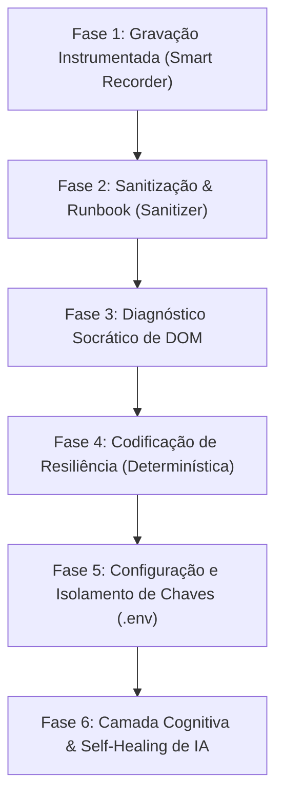

# 🛡️ Guia Prático de Desenvolvimento RPA Aegis

Este guia define o ciclo de vida completo e obrigatório para o desenvolvimento de automações resilientes e estáveis na plataforma **Aegis RPA Suite**. Siga rigorosamente este playbook para garantir conformidade técnica e imunidade a quebras em tempo de execução.

---

## 🗺️ Ciclo de Desenvolvimento em 6 Etapas



---

## 1. ⏺️ Fase 1: Descoberta e Gravação Instrumentada
Nunca escreva seletores do zero ou use gravadores ingênuos. Use o gravador instrumentado do Cockpit:
1. Clique em **⏺️ Gravar Voo** no painel central do Aegis Cockpit.
2. O navegador Edge instrumentado abrirá. Execute o fluxo do processo manualmente seguindo o caminho feliz (Golden Path).
3. **Marque transições críticas:** Durante o fluxo, observe campos reativos de backend (ex: CPF que preenche nome automaticamente), popups de cookies ou telas que demoram a renderizar.
4. Ao fechar o navegador, a gravação gerará a telemetria bruta em `gravacao.json` na pasta do seu projeto.

---

## 2. 🧼 Fase 2: Sanitização e Runbook
Os logs brutos contêm ruídos, movimentos de mouse indesejados e clicks redundantes.
1. No Cockpit, clique em **⚡ Sanitizar Logs** (ou execute `python -m aegis_sanitizer.sanitizer --project-dir .`).
2. O Sanitizador limpará a telemetria e gerará:
   * **`dicionario.json`:** Dicionário de seletores semanticamente estáveis e normalizados.
   * **`relatorio.md`:** Runbook detalhado contendo a ordem exata de preenchimento dos campos e mapeamento de tipos de dados.

---

## 3. 🔍 Fase 3: Diagnóstico Socrático de DOM
Antes de iniciar a codificação do script Python, inspecione a página de destino manualmente (F12) e mapeie as "estranhezas" do portal:
* **Shadow DOM:** Existem Web Components isolando botões ou inputs?
* **Menus CDK Overlays:** Os dropdowns abrem em blocos flutuantes fora da estrutura padrão da página ou estouram os limites visíveis da viewport?
* **Loader Deadlocks:** Loader/Spinner bloqueia interações na tela mesmo depois que o elemento de destino já está visível?
* **Campos Reativos:** Preencher o campo A limpa ou desabilita temporariamente o campo B até terminar a validação de rede?

---

## 4. 💻 Fase 4: Codificação de Resiliência (Offline Determinístico)
Utilize o Playwright com os seguintes padrões de resiliência recomendados:

### A. Shadow DOM Piercing Nativo
Para interagir com elementos dentro de Shadow Roots abertos/fechados, utilize o operador de encadeamento nativo `>>`:
```python
page.click("#shadow-host >> input[value='Database']")
```

### B. Viewport Evaluation (CDK Overlays)
Para menus flutuantes que estouram os limites físicos da tela ou são difíceis de clicar fisicamente, implemente uma estrutura try-except com clique via injeção direta no DOM (JavaScript):
```python
option = page.locator(".cdk-overlay-pane >> mat-option:has-text('Opcao Desejada')")
try:
    option.click(force=True, timeout=2000)
except Exception:
    option.evaluate("el => el.click()") # Fallback limpo
```

### C. Sincronização de Transições Lentas (Anti-Deadlock)
Sempre aguarde loaders ocultarem-se e verifique o estado subsequente de elementos reativos usando polling inteligente antes de prosseguir:
```python
page.fill("#campo-cpf", "12345678900")
# Aguarda até que o campo dependente de nome perca o atributo 'disabled'
page.locator("#campo-nome").wait_for(state="visible")
```

### D. Campos com Detecção de Cadência (Anti-Bot Comportamental)

Portais modernos com Angular Material, React Hook Forms ou Zone.js personalizado
podem monitorar eventos `keydown` e calcular o intervalo médio entre teclas.
Se o intervalo médio for < 8–15ms, o campo é marcado como "não confiável" e o
botão de avançar permanece desabilitado — mesmo com o valor correto preenchido.

**Sintomas no robô:**
- Campo preenchido corretamente, mas botão "Avançar/Submit" permanece desabilitado
- Funciona manualmente mas falha na execução automatizada (sem erros de seletor)
- Screenshot mostra o formulário completo mas com estado inválido
- O Sanitizer reportará `ANTI-BOT COMPORTAMENTAL DETECTADO` no relatorio.md

**Diagnóstico:**
Inspecione o campo no F12 → Event Listeners → verifique se há listener `keydown`.
O Recorder do Aegis detecta isso automaticamente e marca o campo como
`fill_strategy: HUMAN_LIKE` no `dicionario.json`.

**Correção:**
Use `runner.fill_human_like()` ou `runner.fill_resilient(..., strategy="HUMAN_LIKE")`
em vez de `.fill()` para esses campos:
```python
# Digita CPF tecla por tecla com 60ms de delay real entre cada keystroke
runner.fill_human_like(
    page=page,
    selector="[data-testid='campo-cpf']",
    text_val=cpf_val,
    delay_ms=60
)

# Ou equivalentemente, usando fill_resilient com strategy HUMAN_LIKE:
runner.fill_resilient(
    page=page,
    selector="[data-testid='campo-cpf']",
    text_val=cpf_val,
    target_description="Campo CPF do cliente",
    strategy="HUMAN_LIKE",
    delay_ms=60
)
```

**Por que `time.sleep()` e não `keyboard.type(delay=X)`?**
O `keyboard.type(delay=30)` do Playwright agenda os eventos no event loop interno
do browser. O `time.sleep()` bloqueia o processo Python inteiro entre cada tecla,
garantindo que o `performance.now()` do browser registre o intervalo real (≥ delay_ms).

**Regra de ouro:**
- CPF, CNPJ, Nome, RG, Senha → sempre `fill_human_like()` em portais corporativos/gov
- Campos comuns sem validação de cadência → `fill_resilient()` padrão (DIRECT)
- Após AJAX auto-fill (ex: nome preenchido pelo backend ao digitar CPF) →
  não redigitar o campo automático (reset o trust state do simulador)

---

## 5. 🔒 Fase 5: Configuração e Isolamento de Chaves (.env)
Para manter o projeto em conformidade com as regras corporativas de segurança e governança *multi-tenant*, as chaves de API e variáveis cognitivas **devem ser isoladas individualmente por robô**:

1. Crie um arquivo `.env` **exclusivamente na pasta do seu projeto** baseando-se no seguinte modelo:
```env
# Ativa o self-healing e diagnósticos visuais via IA? "true" ou "false"
AEGIS_COGNITIVE_ENABLED=true

# Provedor da API de LLM ("openrouter" ou "litellm")
AEGIS_COGNITIVE_PROVIDER=openrouter

# Chave de API exclusiva deste projeto/RPA (Não compartilhe!)
AEGIS_COGNITIVE_API_KEY=sua_chave_de_api_openrouter_do_projeto

# URL base do provedor
AEGIS_COGNITIVE_BASE_URL=https://openrouter.ai/api/v1

# Modelo LLM para análise visual e diagnose
AEGIS_COGNITIVE_MODEL=google/gemini-2.5-flash
```
> [!IMPORTANT]
> **Nunca** commit ou publique o arquivo `.env` contendo chaves reais. Adicione `.env` ao `.gitignore` local do projeto.

---

## 🧠 6. Fase 6: Camada Cognitiva e Auto-Correção (Self-Healing)
Quando ativado no `.env` local do projeto, o Aegis Runner provê resiliência automática contra seletores falhos ouIDs dinâmicos de backend:

### A. Inicialização no Robô
Inicialize o `TransactionRunner` informando o diretório local do projeto (para que o gateway carregue autonomamente a sua chave do `.env` local de forma isolada):
```python
from aegis_runner.runner import TransactionRunner

runner = TransactionRunner(project_dir=os.path.dirname(os.path.abspath(__file__)))
```

### B. Clique Resiliente Cognitivo
Substitua cliques em elementos críticos de layout e propensos a quebras estruturais pelo helper `click_resilient`. Se o seletor estático falhar no Playwright, a IA de visão computacional agirá recuperando a ação nas coordenadas percentuais exatas:
```python
# Tenta clicar no seletor '#btn-salvar-antigo'. 
# Se falhar, a IA localiza visualmente o botão 'Confirmar' na screenshot e efetua o clique.
runner.click_resilient(
    page=page,
    selector="#btn-salvar-antigo",
    target_description="Botão azul escrito 'Confirmar' no canto inferior",
    timeout=3000
)
```

### C. Triagem e Diagnóstico de Falha Visual
No bloco `except Exception as e` global do seu robô, o runner integrará de forma automática o diagnóstico socrático visual da IA (`diagnose_failure`) caso ocorra uma falha sistêmica, escrevendo a causa raiz (ex: CAPTCHA, queda de servidor ou seletor inexistente) diretamente no seu relatório transacional consolidado em CSV (`relatorio_execucao.csv`).

---

## 7. 🎨 Execução Assistida (Headed Mode) e Efeitos de Realce
Durante a fase de testes e homologação assistida (`AEGIS_BROWSER_HEADLESS=false`), o Aegis injeta automaticamente ferramentas visuais de depuração para guiar o operador humano e as capturas de auditoria:

* **Realce de Foco (Glowing Purple):** Sempre que um campo de entrada (`input`, `textarea`), link (`A`) ou botão (`BUTTON`) recebe foco ou entrada de dados, o Aegis pinta o elemento com borda e fundo lilás translúcido. Os estilos são aplicados inline (`style.setProperty(..., 'important')`) para evitar cortes por contêineres do site com `overflow: hidden`.
* **Indicador de Clique (Pulsing Circle):** Ao clicar, um círculo roxo pulsante é desenhado no ponto do clique. Em cliques programáticos, o Aegis calcula o centro geométrico do elemento via `getBoundingClientRect()` para posicionar o círculo de forma precisa.
* **Visibilidade Permanente de Submenus:** O motor do Aegis força a expansão visível de todos os submenus suspensos da página (dropdowns) em modo headed. Isso previne que cliques físicos quebrem por elementos ocultos e permite registrar os destaques de menus multinível nas capturas de tela.
