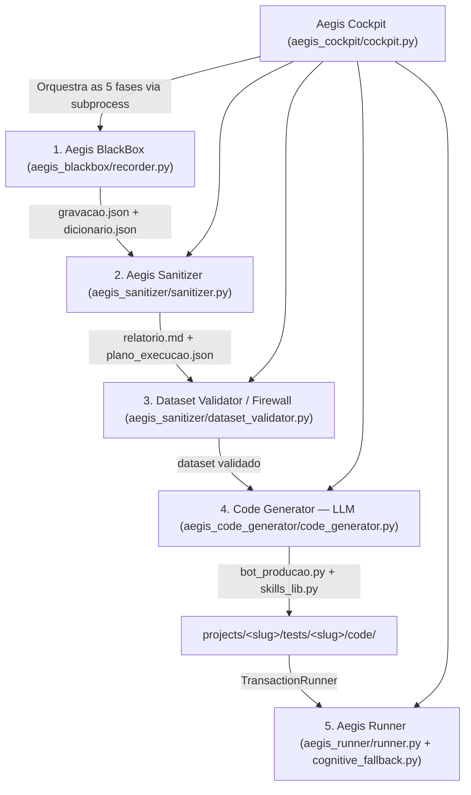

# 🛡️ Aegis RPA Suite: Arquitetura Multicamadas e Manual Operacional

Este documento estabelece a especificação arquitetural, a engenharia de fluxo de dados e o guia operacional de utilização do **Aegis RPA Suite**, um ecossistema projetado para o desenvolvimento e manutenção acelerada de automações robóticas de alta resiliência (Playwright/Python) em ambientes corporativos complexos ou legados.

---

## 📖 1. Visão Geral e Filosofia de Design

O **Aegis RPA Suite** foi concebido sob um princípio fundamental de engenharia de software: **o desacoplamento completo entre o tempo de design (Design-Time) e o tempo de execução (Run-Time)**.

```
┌─────────────────────────────────────────────────────────────────────────┐
│              Fase de Design (Com Inteligência, 4 etapas)                │
│                                                                         │
│  ┌───────────┐   ┌───────────┐   ┌───────────┐   ┌──────────────────┐   │
│  │ 1.BlackBox├──►│2.Sanitizer├──►│3.Validator├──►│4.Code Generator  │   │
│  │ (Gravador)│   │(Compactad.)│  │(Firewall) │   │ (LLM, bot_producao)│  │
│  └───────────┘   └───────────┘   └───────────┘   └────────┬─────────┘   │
└─────────────────────────────────────────────────────────────┼───────────┘
                                                              ▼
┌─────────────────────────────────────────────────────────────────────────┐
│                   Fase de Produção (Zero IA / Estática)                 │
│                                                                         │
│                             ┌──────────────┐                            │
│                             │5.Aegis Runner│◄───────────────────────────┘
│                             │ (Robô Puro)  │
│                             └──────────────┘                            │
└─────────────────────────────────────────────────────────────────────────┘
```

### O Anti-padrão de Automação Tradicional
Tradicionalmente, os robôs de RPA sofrem de duas falhas críticas de arquitetura:
1. **Robôs Ingênuos (Brittle):** Gravam seletores absolutos (XPath/CSS profundos) que quebram a cada alteração sutil de design do sistema alvo.
2. **Robôs Dependentes de IA em Runtime:** Fazem chamadas contínuas de APIs de visão computacional ou LLM a cada clique na tela. Isso introduz **altos custos operacionais de tokens**, **extrema latência de rede** e **vulnerabilidade a falhas de conexão externa**.

### A Solução Aegis
O ecossistema Aegis elimina ambas as fraquezas:
* **Uso Inteligente de IA Limitado ao Design:** A inteligência artificial atua exclusivamente na Fase 4 (**Code Generator**), compilando o robô de produção a partir da telemetria coletada e sanitizada.
* **Execução Estática de Alta Performance por Padrão:** O robô que roda em produção (`aegis_runner/runner.py`) opera com lógica determinística — seletores estáticos, sem chamadas de IA a cada passo. Uma camada **opcional** de auto-correção cognitiva (`aegis_runner/cognitive_fallback.py`) só é acionada quando um seletor estático falha, e só se `AEGIS_COGNITIVE_ENABLED=true` estiver configurado — o padrão do framework é zero dependência de IA em runtime.

---

## 🏗️ 2. Arquitetura Técnica e Módulos

O ecossistema Aegis é projetado de forma modular e desacoplada, separando o motor genérico (`aegis_*`, "sealed engine") dos projetos de automação específicos (RPAs, isolados em `projects/`):



### 1. Aegis BlackBox (O Gravador Instrumentado)
* **Módulo:** `aegis_blackbox/recorder.py` — CLI: `python aegis_blackbox/recorder.py --url "<url>" --output-dir "projects/<slug>" [--control-port <porta>] [--auto-simulate]`.
* **Função:** Capturar de forma passiva e profunda as interações físicas realizadas pelo desenvolvedor num navegador headed (Chromium/Edge), gerando `gravacao.json` (eventos brutos) e `dicionario.json` (dicionário de dados semântico) dentro do `--output-dir` informado.
* **Mecanismos Internos:**
  * **Injeção DOM síncrona:** Injeta listeners JavaScript (`context.add_init_script`) que calculam, no momento do clique/fill, o seletor semântico estável do elemento (`getAegisSelector`/`getAegisSelectorCandidates`), tratando Shadow DOMs recursivamente.
  * **`fallback_selectors`:** Além do seletor primário, a cascata de estratégias coleta até 3 candidatos alternativos validados como únicos no DOM no momento da captura — usados pelo Runner como recuperação determinística (sem IA) quando o seletor primário falha.
  * **Detecção Anti-Bot Comportamental:** Monkey-patch de `addEventListener` detecta campos que monitoram `keydown`/`keyup` (proteção anti-bot de portais corporativos/gov) e marca `"fill_strategy": "HUMAN_LIKE"` no `dicionario.json`.
  * **Network Interceptor:** Monitora e grava payloads JSON de respostas de API que alimentam mapeamentos dinâmicos (dropdowns código→label).
  * **Preservação semântica em re-gravação:** Se um projeto já passou pelo Sanitizer (chaves semânticas como `usuario_login`), regravar auto-preserva essas chaves por casamento de seletor — avisa apenas para campos cujo seletor mudou de fato.
  * **Blindagem de RPA:** O BlackBox é genérico e blindado — simuladores e scripts de inspeção específicos de um RPA residem fora dele, em `projects/<slug>/` (nunca dentro de `aegis_blackbox/`).

### 2. Aegis Sanitizer (O Compactador de Telemetria)
* **Módulo:** `aegis_sanitizer/sanitizer.py` — CLI: `python aegis_sanitizer/sanitizer.py --project-dir projects/<slug>`.
* **Função:** Deduplica e filtra a telemetria do Recorder, produzindo `relatorio.md` (legível por humano e por LLM) e reescrevendo um `gravacao.json` limpo, além de compilar `plano_execucao.json` (o plano de execução por `step_id` consumido pela Fase 4).
* **Mecanismos Internos:**
  * **Filtro de redundância:** Remove cliques duplicados e fills repetidos com o mesmo valor no mesmo seletor.
  * **Reordenação de pares dropdown:** Corrige a ordem fill→click em padrões de autocomplete Angular Material (`[role='option']`).
  * **Padrão Q (dinâmico):** Remove tokens gerados em runtime (ex.: número de proposta) de `has_text` quando não há evidência de que o valor existe no dataset.
  * **Enforcement de `weak_selector`:** Sinaliza estruturalmente seletores ambíguos sem âncora (`WEAK_SELECTOR_WITHOUT_ANCHOR`) antes de chegar à Fase 4.
  * **Propagação de `fallback_selectors`** para o `plano_execucao.json`, aplicando o mesmo Padrão Q e dedup contra o seletor primário.
  * **Contrato de alta fidelidade (schema v2 do `plano_execucao.json`):** o Sanitizer **classifica em vez de deletar**. Nenhum evento some de `gravacao.json` — cada evento ganha `sanitizer_class` (`role`/`keep`/`reason`) e `original_index` antes de qualquer reordenação física. O plano usa dois espaços de id disjuntos: `st_NNN` para steps emitíveis (numerados exatamente como o pipeline sempre produziu — zero drift de `step_id` para bots e correções já existentes) e `sup_NNN` para steps suprimidos, intercalados no array na posição física original. Cada step carrega `execution_hint` (`required` quando ausente/default, `optional`, ou `skip`); o plano abre com `fidelity_summary` (`raw_events`, `steps_required`, `steps_optional`, `steps_suppressed`, `merges`). Steps colapsados (cliques duplicados, pares de dropdown) preservam o rastro em `merged_from`/`source_events`; steps suprimidos carregam `step_role` (`overlay_noise`, `stale_panel_click`, `redundant_refill`, `raw_duplicate_click`, `superseded_correction`, `phantom_click`) e `suppression_reason`. O Code Generator (Fase 4) vê os `sup_` no prompt em forma compacta e só os emite se a correção acumulada ou o fluxo exigirem — reintroduzindo o `step_id` já existente, nunca inventando um novo.

### 3. Dataset Validator / Firewall (Guardião de Dados)
* **Módulo:** `aegis_sanitizer/dataset_validator.py` — CLI: `python aegis_sanitizer/dataset_validator.py --dataset projects/<slug>/dataset_inicial.json --project-dir projects/<slug>`.
* **Função:** Valida `dataset_inicial.json`/`.csv` contra o dicionário de dados do projeto antes da geração de código. É **tolerante por padrão** — só bloqueia erros estruturais críticos (ex.: coluna obrigatória totalmente ausente), não formatos de valor.

### 4. Aegis Code Generator (Compilação Híbrida: Motor Determinístico + Slots Cognitivos via LLM)
* **Módulo:** `aegis_code_generator/code_generator.py` — CLI: `python aegis_code_generator/code_generator.py --project-dir projects/<slug>`.
* **Função:** Compila `bot_producao.py` + `skills_lib.py`. Quando precisa de LLM, chama um provedor (OpenRouter, LiteLLM, ou qualquer endpoint compatível com OpenAI — configurado via `AEGIS_COGNITIVE_PROVIDER`/`AEGIS_COGNITIVE_API_KEY`/`AEGIS_COGNITIVE_MODEL`, com `AEGIS_COGNITIVE_CODER_MODEL` opcional dedicado a esta fase). Requer o `plano_execucao.json` da Fase 2 e o dataset validado da Fase 3.
* **Dois fluxos:**
  * **Geração nova:** compila o robô do zero a partir do `plano_execucao.json` e do catálogo de padrões de resiliência — hoje bifurcada em híbrido (padrão) vs. full-LLM (fallback), ver abaixo.
  * **Correção cirúrgica:** usa os comentários âncora `# [PASSO X]` já presentes no código para corrigir apenas os passos falhos apontados, sem regenerar o script inteiro.
* **Motor híbrido da geração nova (`AEGIS_CODEGEN_HYBRID`, default `true`):** um módulo novo, `aegis_code_generator/deterministic_emitter.py`, é a **inversão** dos validadores de `step_validator.py` — em vez de só *cobrar* que um padrão de resiliência foi seguido, ele o *produz* mecanicamente, sem nenhuma chamada LLM. Para cada step do plano, `classify_step` aplica dez condições conservadoras (C1-C10 — tipo suportado, binding único e não-ambíguo no `dicionario.json`, ausência do token dinâmico do Padrão Q em `parent.has_text`, `weak_selector` com material de ancoragem mecânica, fora da heurística de menu suspenso do Padrão N, step não referenciado por nenhuma correção pendente, `fill` que não precede um autocomplete/painel de opção dinâmica, e nenhum valor de negócio (`observed_value` do dicionário) embutido no seletor ou no `has_text`); qualquer dúvida classifica o step como cognitivo — política deliberadamente conservadora. Steps `deterministic` viram código direto via `emit_step_block` (mesmas chamadas `click_resilient`/`click_chained`/`fill_resilient`/`select_option_resilient`/`select_option_native_resilient` que a geração full-LLM sempre produziu); steps `cognitive` viram um placeholder parseável (`# AEGIS_COGNITIVE_SLOT step_id="st_014" motivo="..."`) preenchido por **uma única chamada LLM** cobrindo só esses blocos (nunca o arquivo inteiro) — um plano sem nenhum slot cognitivo não faz nenhuma chamada LLM na geração nova. Steps `sup_`/`skip` nunca viram código (`omit`), como já era o contrato v2 do Sanitizer. O fluxo cai para full-LLM (arquivo inteiro, comportamento anterior a esta mudança) quando `AEGIS_CODEGEN_HYBRID=false`, o projeto usa `skills_used`, o `plano_execucao.json` está ausente, ou a resposta da LLM não cobre todos os slots pedidos numa tentativa.
* **Proveniência e anti-drift no Ralph Loop:** toda geração bem-sucedida grava `code/generation_manifest.json` ao lado do bot, com `provenance` por `step_id` (`deterministic`, `cognitive`, ou `cognitive_patched` após uma correção QA tocar um bloco originalmente determinístico) e `plan_checksum`. Durante as tentativas do Ralph Loop, uma etapa nova restaura incondicionalmente a forma canônica de qualquer bloco `deterministic` fora do escopo da correção corrente antes de revalidar — evita que uma reescrita de arquivo inteiro na fase de reflection "melhore" (ou corrompa) um bloco que já estava correto por construção.
* **Catálogo de padrões:** O prompt de geração carrega `aegis_mentor/skills/rpa-copilot-coder.md` (18 padrões de resiliência, ver seção 3) diretamente como parte da instrução ao LLM — não é uma skill instalada externamente em nenhum outro sistema, é lida e injetada em runtime pelo próprio `code_generator.py`.
* **Saída:** `bot_producao.py` + `skills_lib.py` + `code/generation_manifest.json` salvos em `projects/<slug>/tests/<slug_do_teste>/code/`.

### 5. Aegis Runner & Cognitive Gateway (Execução e Resiliência)
* **Módulos:** `aegis_runner/runner.py` (`TransactionRunner`) e `aegis_runner/cognitive_fallback.py` (`CognitiveGateway`, opcional).
* **Função:** Motor determinístico de execução. Itera sobre o dataset e cria uma página Playwright **isolada por linha** — erro, diálogo ou crash numa linha nunca afeta as demais.
* **Mecanismos Internos:**
  * **Zero-LLM Runtime por Padrão:** roda offline com seletores estáticos; a camada cognitiva só entra se `AEGIS_COGNITIVE_ENABLED=true`.
  * **Cadeia de resiliência determinística (antes de qualquer IA):** `click_resilient`/`fill_resilient` tentam, em ordem: seletor primário → heurística multi-elemento → Escape+retry → `fallback_selectors` gravados na Fase 1 (Nível 2.9, roda mesmo sob `strict=True` por não ser "adivinhação"). Só then, se `strict=False`, cai para `self_healing_click` (LLM visual) e por último coordenada gravada.
  * **Sensor `CLICK_NO_EFFECT` (Passo Fantasma):** como `click_resilient` usa `force=True` (pula a checagem nativa de actionability), o runner tira snapshot de página (URL, contagem de nós DOM, overlays, fingerprint de classe) antes/depois de cada clique; se nada mudou, aciona a mesma cadeia de recuperação determinística antes de fechar o passo, em vez de aceitar um falso-sucesso silencioso.
  * **Sensor `ENABLE_TIMEOUT`:** para cliques cujo alvo só habilita após validação assíncrona do app (ex.: botão gated numa busca de CPF), o runner espera a habilitação (qualquer seletor, com timeout configurável) e, se estourar, recupera reexecutando os fills recentes de um buffer em memória (`self._recent_fills`) antes de decidir por falha genuína.
  * **Diagnóstico de Falhas (`diagnose_failure`):** em erro fatal insolúvel, envia screenshot + histórico de passos ao LLM para diagnóstico visual/semântico de causa raiz antes do encerramento.
  * **Rastreamento de Self-Healing (Sensor F1):** toda camada que resolve um passo via healing (visual, coordenada, `fallback_selectors`, `click_no_effect_recovered`, `enable_timeout_recovered`) auto-registra uma entrada `needs_review` em `correcoes_acumuladas.json`, dedupada por `(ação, seletor)` enquanto pendente.
  * **Restart de linha para passos `flaky`:** passos marcados `"flaky": true` no plano (via Cockpit, após confirmação humana de intermitência) disparam reinício da transação inteira daquela linha (até 3 tentativas) antes de liberar self-healing.
  * **Captura de Evidências:** `historico_passos.json` + relatório CSV por lote, screenshots opcionais por passo (`AEGIS_STEP_SCREENSHOTS`).

### 6. Aegis Cockpit (O Painel Orquestrador Modular)
* **Módulo:** `aegis_cockpit/cockpit.py` — servidor HTTP custom (`http.server`), serve a SPA (`static/index.html`) e expõe a REST API. Delega para `aegis_cockpit/project_manager.py` (CRUD de projetos/cenários, histórico de versões, `correcoes_acumuladas.json`, skills, config DevOps) e `aegis_cockpit/process_manager.py` (dispara as Fases 1–5 como subprocessos isolados via `subprocess.Popen`, streaming de stdout).
* **Porta:** ordem de precedência — `aegis_config.json` (campo `"port"`, padrão do projeto `8075`) → variável de ambiente `AEGIS_COCKPIT_PORT` → fallback `8080` embutido no código, se nenhum dos dois estiver presente.
* **Integração DevOps (`aegis_devops/`):** publica pipeline YAML, grupos de variáveis e casos de teste no Azure DevOps (`publish_pipeline.py`), converte relatórios CSV de execução em JUnit XML (`junit_reporter.py`), via REST API (sem exigir binário `git` local).

### 🔒 7. Política de Segurança, Isolamento de RPAs e Zero Hardcodes
* **Regra Absoluta contra Hardcodes:** O código dos robôs ou utilitários jamais deve conter credenciais fixas, senhas, tokens de API, portas ou URLs estáticas de homologação/produção.
* **Mecanismo:** Todas as variáveis de ambiente necessárias (como `AEGIS_COGNITIVE_API_KEY`, ou credenciais específicas de projeto carregadas do `.env` do projeto) devem ser carregadas via `os.getenv()`. Se um parâmetro obrigatório de produção não estiver presente no ambiente, o robô deve lançar imediatamente um `ValueError` estruturado, impedindo execuções com configurações padrão inválidas. Valores de negócio observados (CPF, nome, opção de dropdown) nunca são hardcoded — sempre `row.get("<chave_semantica>", "")`.
* **Isolamento de Projetos e Proteção do Core Framework (Aegis Suite Blindado):**
  * **Não Geração de Arquivos na Raiz:** Não devem ser gerados arquivos na raiz do projeto (exceto em casos de extrema necessidade, como arquivos de dependências de alto nível ou metadados de configuração da IDE).
  * **Artefatos Específicos Isolados:** Artefatos específicos de um sistema (logs de execução, capturas de tela, datasets, relatórios) só podem ser gerados e salvos dentro da estrutura de pastas do próprio projeto (`projects/<slug>/`), nunca dentro de pastas do motor Aegis.
  * **Separação Externa de Projetos:** Tudo o que for específico de um processo automatizado (RPA) deve ser externo ao motor. A estrutura `aegis_runner`, `aegis_blackbox`, `aegis_cockpit`, `aegis_sanitizer`, `aegis_code_generator`, `aegis_mentor` é um motor blindado e não deve receber alterações específicas de um robô.
  * **Localização de `projects/` e `telemetry_data/`:** ambas ficam no nível de projeto, nunca aninhadas dentro das pastas internas de ferramentas do framework.

---

## 🎨 3. O Catálogo de Padrões de Resiliência Aegis

O catálogo completo, com problema/solução/exemplo de código para cada padrão, vive em `aegis_mentor/skills/rpa-copilot-coder.md` — é a fonte de verdade lida diretamente pelo `code_generator.py` (Fase 4) a cada compilação. Esta seção resume os **18 padrões atuais** (a numeração de letras pula a "I" por convenção do catálogo original); os primeiros sete têm o maior histórico de uso e são detalhados abaixo com exemplo de código.

### Padrão A: Shadow DOM Piercing Nativo
* **Cenário:** Inputs e botões encapsulados dentro de estruturas de Web Components.
* **Arquitetura:** O Playwright realiza a travessia profunda e síncrona de Shadow Roots abertos usando o operador nativo `>>`.
* **Implementação:**
  ```python
  page.click("#shadow-checkbox-filters-host >> input[value='Database']")
  ```

### Padrão B: Interceptação de APIs de Rede (Network Mappings)
* **Cenário:** Dropdowns (como `mat-select`) que expõem labels amigáveis na interface mas recebem códigos numéricos do backend.
* **Arquitetura:** Interceptador síncrono que escuta o tráfego e monta em tempo real um dicionário de correspondência Código-Label em memória.
* **Implementação:**
  ```python
  domain_mappings = {}
  def handle_response(response):
      if "api_domain_parcelamento.json" in response.url:
          data = response.json()
          for item in data:
              domain_mappings[item["code"]] = item["label"]
  page.on("response", handle_response)
  ```

### Padrão C: Sequência Cognitiva de Desvio de Deadlock
* **Cenário:** Formulários reativos assíncronos que travam inputs dependentes (deadlocks de validação) caso o desenvolvedor preencha os campos fora da ordem esperada pela lógica do framework.
* **Arquitetura:** Ordenação algorítmica estrita: limpa campos secundários, preenche o pai, valida-o, preenche o filho e restaura o secundário.
* **Implementação:**
  ```python
  page.fill("#angular-field-b", "") # 1. Limpa B
  page.fill("#angular-field-a", "Dados A") # 2. Preenche A
  page.click("#btn-validate-field-a") # 3. Valida A (liberando o campo C)
  page.fill("#angular-field-c", "Dados C") # 4. Preenche C
  page.fill("#angular-field-b", "Dados B") # 5. Restabelece B
  ```

### Padrão D: Clique Forçado via Viewport Evaluation (JS Click Fallback)
* **Cenário:** Menus CDK Overlay com posicionamento absoluto que estouram o limite visível da tela, causando falhas de rolagem.
* **Arquitetura:** Tentativa de clique com bypass de visibilidade (`force=True`). Em caso de falha, injeção direta de JS de clique no nó do DOM do navegador.
* **Implementação:**
  ```python
  option_locator = page.locator(".cdk-overlay-pane >> .mat-option:has-text('Label')")
  try:
      option_locator.click(force=True, timeout=2000)
  except Exception:
      option_locator.evaluate("el => el.click()") # Fallback de contingência
  ```

### Padrão E: Sincronização Assíncrona de Loaders Globais
* **Cenário:** Telas reativas que aplicam transições e overlays invisíveis de loading que interceptam cliques do robô.
* **Arquitetura:** Esperas síncronas explícitas de estado oculto (`state="hidden"`).
* **Implementação:**
  ```python
  def wait_for_aegis_loader(page):
      try:
          page.wait_for_selector("#panel-loader-view", state="hidden", timeout=5000)
      except Exception:
          pass
  ```

### Padrão F: Clique Reativo com Checagem de Efeito Colateral
* **Cenário:** Botões carregados no DOM antes que seus listeners JS (Angular/React bindings) estejam ativos — cliques "perdidos" que não avançam o estado da aplicação.
* **Arquitetura:** Loop curto de repetição que monitora um efeito colateral (mudança de URL, visibilidade de um novo elemento) antes de parar de clicar.

### Padrão G: Modais Empilhados Ambíguos
* **Cenário:** Sobreposição de múltiplos diálogos CDK simultâneos que geram seletores ambíguos.
* **Arquitetura:** Modificador `.last` no seletor do modal para atingir estritamente a camada de topo.

### Padrão K: Manipulação de Objetos Tipo Calendário (Date Pickers)
* **Cenário:** Calendários reativos ou fechados em modais que barram o preenchimento manual via teclado.
* **Arquitetura:** Preenchimento direto via teclado (`Control+A` + digitação). Se bloqueado por `readonly`, injeção DOM via `evaluate` disparando `input`/`change`.
* **Implementação:**
  ```python
  input_selector = "input[name='data_nascimento']"
  page.click(input_selector)
  page.press(input_selector, "Control+A")
  page.fill(input_selector, "25/05/2026")
  page.press(input_selector, "Tab")
  ```

### Padrão L: Upload de Arquivos via File Chooser e Injeção DOM
* **Cenário:** Botões de upload/drag-and-drop customizados que ocultam o `<input type="file">` nativo.
* **Arquitetura:** `page.expect_file_chooser()` ou atribuição direta via `set_input_files`.
* **Implementação:**
  ```python
  with page.expect_file_chooser() as fc_info:
      page.click("#custom-drag-drop-area")
  fc_info.value.set_files("C:/workspace/comprovante.pdf")
  ```

### Demais padrões (H, J, M–R) — resumo

| Padrão | Problema | Solução |
|---|---|---|
| **H** — Proteção de Estado (State Guarding) | Erro não capturado no início do formulário deixa o robô prosseguir cegamente, gerando timeouts em cascata. | Asserção explícita de transição logo após cada passo crítico; aborta com erro técnico específico se não ocorrer no prazo. |
| **J** — Sincronização de Transições Assíncronas | Wizards com chamadas de backend lentas antes de renderizar a tela seguinte, ou toggle que revela campo condicional na mesma tela. | Nunca usar `sleep` fixo — `wait_for(state="visible")` no elemento de destino; para campo condicional, polling pelo campo dependente antes de interagir com ele. |
| **M** — Digitação Cadenciada Anti-Bot | `.fill()`/`keyboard.type()` sem delay é detectado por monitoramento de `keydown` (Zone.js/React Hook Forms), deixando o botão de submit desabilitado silenciosamente. | Campos marcados `fill_strategy: "HUMAN_LIKE"` no `dicionario.json` usam **exclusivamente** `runner.fill_human_like()` (delay real entre teclas, ~60ms). |
| **N** — Dropdowns Hover-to-Reveal | Itens de submenu (`.sub-menu`) só ficam clicáveis após hover no pai. | Seletor encadeado `Pai >> Filho`; `click_resilient` executa o hover automático antes do clique. |
| **O** — Custom Selects | Dropdowns não-nativos (Angular Material, Vuetify) geram seletor genérico ambíguo no trigger. | `runner.select_option_resilient()` encapsula abrir+selecionar num único método. |
| **P** — Inversão de Eventos em Autocomplete | O recorder pode capturar o clique na opção antes do fill do input de busca (ordem de eventos do `blur`). | O gerador **inverte** a ordem no código compilado: fill do input → aguardar renderização → clique na opção. |
| **Q** — Locator Encadeado por Hierarquia | Seletor genérico casa múltiplos elementos em grids/tabelas repetitivas. | `runner.click_chained()`/`fill_chained()` com `parent` (`selector`+`has_text`) e `child`; `has_text` nunca usa token dinâmico gerado pelo sistema-alvo (só valores estáveis do dataset); `strict=True` como rede de segurança quando não há fragmento estável suficiente. |
| **R** — Passos Flaky com Restart por Linha | Falha intermitente conhecida (não estrutural) num passo específico. | Passo marcado `"flaky": true` no plano dispara reinício da transação inteira da linha (até 3 tentativas) antes de liberar self-healing; decisão 100% no runner, sem mudança no código gerado. |

---

## 📖 4. Manual de Operação Passo a Passo (Mapeamento de Nova Aplicação)

Siga este procedimento operacional padrão para construir um novo robô do absoluto zero em qualquer portal.

### Pré-requisitos
```powershell
cd C:\Projetos\aegis_rpa_suite
pip install -r requirements.txt
playwright install chromium
```

### Passo 1: Gravar com o Aegis BlackBox
```powershell
python aegis_blackbox/recorder.py --url "https://portal.suaempresa.com.br/login" --output-dir "projects/meu_projeto" --control-port 9900
```
* **O que acontece:** um navegador headed é aberto; `--control-port` sobe um servidor HTTP local de controle (widget flutuante de anotações).
* **Ação Humana:** execute o processo normalmente. Ao chegar em esperas de rede, validações cognitivas ou mudanças de tela cruciais, registre uma nota via widget do BlackBox.
* **Finalização:** feche a janela do navegador para consolidar `gravacao.json` + `dicionario.json` em `projects/meu_projeto/`.

### Passo 2: Compactar a Telemetria com o Aegis Sanitizer
```powershell
python aegis_sanitizer/sanitizer.py --project-dir projects/meu_projeto
```
* **Resultado:** `relatorio.md` (legível) e `plano_execucao.json` gerados em `projects/meu_projeto/`.

### Passo 3: Validar o Dataset (Firewall)
```powershell
python aegis_sanitizer/dataset_validator.py --dataset projects/meu_projeto/dataset_inicial.json --project-dir projects/meu_projeto
```
* **Resultado:** validação estrutural do dataset contra o dicionário — bloqueia apenas erros críticos (ex.: coluna obrigatória ausente).

### Passo 4: Compilar o Robô com o Code Generator
```powershell
python aegis_code_generator/code_generator.py --project-dir projects/meu_projeto
```
* **Pré-requisito:** variáveis de ambiente de LLM configuradas (`AEGIS_COGNITIVE_ENABLED=true`, `AEGIS_COGNITIVE_API_KEY`, `AEGIS_COGNITIVE_PROVIDER`, `AEGIS_COGNITIVE_MODEL`) em `.env` no projeto ou na raiz do framework.
* **O que acontece:** o Code Generator lê `plano_execucao.json` + `dicionario.json` + dataset validado, aplica o catálogo de padrões de resiliência (`aegis_mentor/skills/rpa-copilot-coder.md`) e chama o LLM configurado para compilar o script.
* **Resultado:** `bot_producao.py` + `skills_lib.py` salvos em `projects/meu_projeto/tests/<slug_do_teste>/code/`.

### Passo 5: Executar o Robô
```powershell
python projects/meu_projeto/tests/<slug_do_teste>/code/bot_producao.py
```
* Configure antes as credenciais/URLs obrigatórias do projeto via `.env` — o script levanta `ValueError` se algo estiver faltando.
* **Conformidade:** `historico_passos.json` + relatório CSV de auditoria são gravados em `projects/meu_projeto/tests/<slug_do_teste>/executions/` a cada execução.

> Alternativa recomendada para o dia a dia: rodar as 5 fases pelo **Aegis Cockpit** (`python aegis_cockpit/cockpit.py`, porta padrão `8075`), que orquestra os mesmos comandos acima como subprocessos via interface web.

---

## 🔍 5. Diferenciação Fatos vs. Suposições (Aegis Suite)

* **Fatos Técnicos Comprovados:**
  * A interceptação síncrona de rede (Padrão B) permite contornar dropdowns com códigos internos sem mapeamentos estáticos mantidos manualmente.
  * O Runner isola uma página Playwright por linha do dataset — falha numa linha não afeta as demais.
  * Toda camada de self-healing (visual, coordenada, `fallback_selectors`, `click_no_effect_recovered`, `enable_timeout_recovered`) registra `needs_review` em `correcoes_acumuladas.json` para triagem humana posterior.
  * O Sanitizer (schema v2 do `plano_execucao.json`) preserva 100% dos eventos capturados — classifica em vez de deletar; `gravacao.json` e `plano_execucao.json` mantêm o mapa completo da gravação (inclusive o que foi suprimido) para auditoria, correção e reintrodução seletiva pelo Code Generator.
* **Suposições Operacionais:**
  * Assume-se que o navegador (Edge/Chromium) da máquina local possui atualizações recentes o suficiente para evitar incompatibilidades de injeção JavaScript.
  * Supõe-se que, caso o portal alvo aplique CSP estrita contra scripts de terceiros, o desenvolvedor deverá configurar políticas adicionais de bypass no Playwright.
  * A camada cognitiva (self-healing por IA, diagnóstico de falha) depende de disponibilidade e latência do provedor de LLM configurado — não há fallback determinístico caso a API esteja fora do ar durante uma execução em `strict=False` que precise dela.
