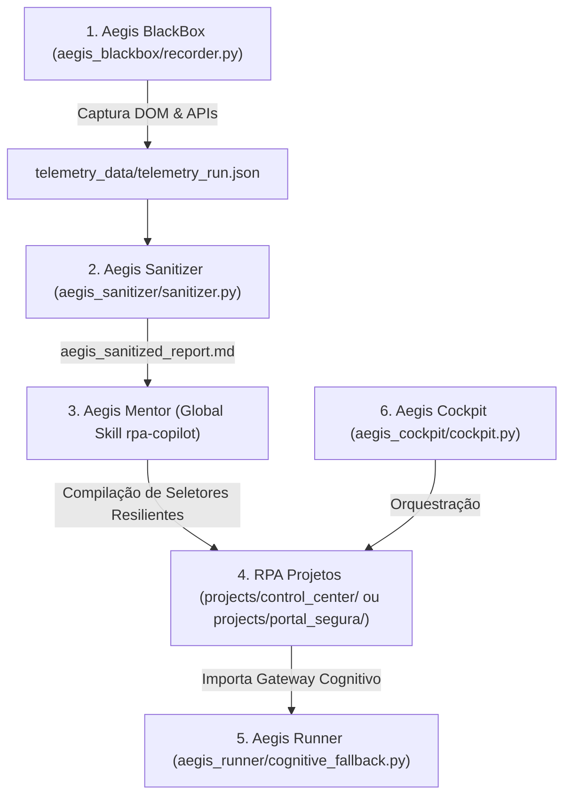

# 🛡️ Aegis RPA Suite: Arquitetura Multicamadas e Manual Operacional

Este documento estabelece a especificação arquitetural, a engenharia de fluxo de dados e o guia operacional de utilização do **Aegis RPA Suite**, um ecossistema projetado para o desenvolvimento e manutenção acelerada de automações robóticas de alta resiliência (Playwright/Python) em ambientes corporativos complexos ou legados.

---

## 📖 1. Visão Geral e Filosofia de Design

O **Aegis RPA Suite** foi concebido sob um princípio fundamental de engenharia de software: **o desacoplamento completo entre o tempo de design (Design-Time) e o tempo de execução (Run-Time)**.

```
┌─────────────────────────────────────────────────────────────────────────┐
│                     Fase de Design (Com Inteligência)                   │
│                                                                         │
│   ┌──────────────────┐      ┌─────────────────┐      ┌──────────────┐   │
│   │ Aegis BlackBox   ├─────►│ Aegis Sanitizer ├─────►│ Aegis Mentor │   │
│   │ (Voo Instrument.)│      │ (Compactador)   │      │ (Skill IA)   │   │
│   └──────────────────┘      └─────────────────┘      └──────┬───────┘   │
└─────────────────────────────────────────────────────────────┼───────────┘
                                                              ▼
┌─────────────────────────────────────────────────────────────────────────┐
│                   Fase de Produção (Zero IA / Estática)                 │
│                                                                         │
│                             ┌──────────────┐                            │
│                             │ Aegis Runner │◄───────────────────────────┘
│                             │ (Robô Puro)  │
│                             └──────────────┘                            │
└─────────────────────────────────────────────────────────────────────────┘
```

### O Anti-padrão de Automação Tradicional
Tradicionalmente, os robôs de RPA sofrem de duas falhas críticas de arquitetura:
1. **Robôs Ingênuos (Brittle):** Gravam seletores absolutos (XPath/CSS profundos) que quebram a cada alteração sutil de design do sistema alvo.
2. **Robôs Dependentes de IA em Runtime:** Fazem chamadas contínuas de APIs de visão computacional ou LLM a cada clique na tela. Isso introduz **altos custos operacionais de tokens**, **extrema latência de rede** e **vulnerabilidade a falhas de conexão externa**.

### A Solução Aegis
O ecossistema Aegis elimina ambas as fraquezas:
* **Uso Inteligente de IA Limitado ao Design:** A inteligência artificial (através da Skill global `Aegis Mentor`) atua exclusivamente na fase de **compilação estrutural**, projetando o robô inicial baseado na telemetria coletada.
* **Execução Estática de Alta Performance:** O robô que roda nos servidores de produção (`Aegis Runner`) opera com lógica determinística pura. Ele executa na velocidade máxima de renderização do Microsoft Edge corporativo, com custo zero de tokens e zero dependência de IA em runtime.

---

## 🏗️ 2. Arquitetura Técnica e Módulos

O ecossistema Aegis é projetado de forma modular e desacoplada, separando o motor genérico dos projetos de automação específicos (RPAs):



### 1. Aegis BlackBox (O Gravador Instrumentado)
* **Função:** Capturar de forma passiva e profunda as interações físicas realizadas pelo desenvolvedor no navegador corporativo (headed Edge).
* **Mecanismos Internos:**
  * **Injeção DOM síncrona:** Injeta um listener JavaScript (`page.add_init_script`) que calcula, no exato milissegundo do clique, o seletor semântico estável do elemento clicado, tratando Shadow DOMs recursivamente.
  * **Network Interceptor:** Monitora e grava payloads JSON de APIs que retornam dados estruturados (mapeamentos dinâmicos).
  * **Blindagem de RPA:** O BlackBox é genérico e blindado. Todos os simuladores e scripts de inspeção específicos dos RPAs residem estritamente fora dele, na pasta `projects/`.

### 2. Aegis Sanitizer (O Compactador de Telemetria)
* **Função:** Processar, filtrar e resumir os logs de interações em um formato de alta fidelidade digerível por LLMs.
* **Mecanismos Internos:**
  * **Filtro de redundância:** Remove repetições de cliques (duplos cliques acidentais) e inputs duplicados, gerando um fluxo de eventos unificado.
  * **Sanitização de APIs:** Trunca e resume payloads de rede extensos, extraindo apenas chaves estruturais.
  * **Compilação Markdown:** Exporta o fluxo final estruturado em um relatório Markdown limpo para a IA.

### 3. Aegis Mentor (A Skill Global de IA)
* **Função:** Atuar como o Arquiteto RPA. Ingerir o relatório do Sanitizer e compilar o script final aplicando técnicas de contorno.
* **Mecanismos Internos:**
  * **Skill Global do Antigravity (`rpa-copilot`):** Instalado no diretório global do sistema do usuário (`.gemini/config/plugins/rpa-copilot-plugin`), aplicando automaticamente o catálogo de padrões de resiliência e as regras de banimento total de hardcodes.

### 4. Aegis Runner & Cognitive Gateway (Auto-Correção e Resiliência Cognitiva)
* **Função:** Motor determinístico do robô integrado à camada opcional de auto-correção por Inteligência Artificial (Self-Healing), triagem visual de erros em runtime e efeitos de realce visuais para auditoria.
* **Mecanismos Internos (`cognitive_fallback.py` & `runner.py`):**
  * **Zero-LLM Runtime por Padrão:** O robô executa de forma offline com seletores estáticos e performance máxima.
  * **Self-Healing Cognitivo (`self_healing_click`):** Se um seletor estático falhar (por exemplo, devido a um redesign do portal), o robô ativa o gateway cognitivo, captura uma screenshot e solicita à LLM (via LiteLLM ou OpenRouter) coordenadas percentuais do elemento para emular o clique físico do mouse.
  * **Diagnóstico de Falhas (`diagnose_failure`):** Caso ocorra um erro fatal insolúvel, o robô envia a screenshot da tela e o fragmento do DOM para que a LLM faça um diagnóstico visual de causa raiz antes do encerramento.
  * **Visibilidade Forçada de Submenus (Dropdown Expansion):** Em modo headed, o runner força estilos CSS que mantêm todas as tags de submenu (`.sub-menu`, dropdowns, etc.) permanentemente visíveis. Isso elimina timeouts de cliques físicos por elementos ocultos e garante que a execução ocorra sem atrasos de transições hover.
  * **Captura de Evidências:** Gravação síncrona de logs e traces compactados (`.zip`) em `telemetry_data/`.

### 5. Aegis Cockpit (O Painel Orquestrador Modular)
* **Função:** Painel gráfico administrativo em Flask que permite monitorar logs, visualizar traces de execução, e disparar execuções de robôs localizados sob a pasta `projects/`.
* **Mecanismos Internos:**
  * Totalmente modularizado em `aegis_cockpit/cockpit.py`.
  * Configuração flexível de portas de escuta HTTP via variável de ambiente `AEGIS_COCKPIT_PORT`.
  * Execução segura de RPAs como subprocessos isolados, forçando o diretório de execução correto (`cwd=PROJECT_ROOT`).
  * **Interface Dual-State:** Reestruturada para operar em dois modos (Portal de Projetos e Workspace do Projeto) otimizando a usabilidade por meio de um grid global com barra de busca rápida e barra lateral dedicada exclusivamente aos cenários do projeto ativo.

### 🔒 6. Política de Segurança, Isolamento de RPAs e Zero Hardcodes
* **Regra Absoluta contra Hardcodes:** O código dos robôs ou utilitários jamais deve conter credenciais fixas, senhas, tokens de API, portas ou URLs estáticas de homologação/produção.
* **Mecanismo:** Todas as variáveis de ambiente necessárias (como `CONTROL_CENTER_USER`, `PORTALSEGURA_USER`, `AEGIS_COGNITIVE_API_KEY`) devem ser carregadas via `os.getenv()`. Se um parâmetro obrigatório de produção não estiver presente no ambiente, o robô deve lançar imediatamente um `ValueError` estruturado, impedindo execuções com configurações padrão inválidas.
* **Isolamento de Projetos e Proteção do Core Framework (Aegis Suite Blindado):**
  * **Não Geração de Arquivos na Raiz:** Não devem ser gerados arquivos na raiz do projeto (exceto em casos de extrema necessidade, como arquivos de dependências de alto nível ou metadados de configuração da IDE).
  * **Artefatos Específicos Isolados:** Artefatos específicos de um sistema (como logs de execução, capturas de tela, templates de CSV, datasets e relatórios temporários do Portal Segura) só podem ser gerados e salvos dentro da sua própria estrutura de pastas do projeto (ex: subpastas em `projects/`), nunca dentro de pastas da suíte do Aegis.
  * **Separação Externa de Projetos:** Tudo o que for específico de um processo automatizado (RPA) ou de um projeto deve ser externo à pasta principal do Aegis. A estrutura do Aegis (como `aegis_runner`, `aegis_blackbox`, `aegis_cockpit`, `aegis_sanitizer`, `aegis_mentor`) é um motor blindado e deve ser protegida contra alterações específicas de robôs.
  * **Localização de Projects e Telemetry_Data:** As pastas `projects/` (que armazena os códigos-fonte dos RPAs específicos) e `telemetry_data/` (que armazena os dados transacionais de inputs/outputs dos testes e execuções) devem ficar localizadas externamente à suíte core do Aegis (no nível de projeto ou sob diretórios de integração dedicados), nunca misturadas ou aninhadas dentro das pastas internas de ferramentas do framework.

---

## 🎨 3. O Catálogo de Padrões de Resiliência Aegis

Os scripts gerados pelo *Aegis Mentor* implementam cinco padrões fundamentais para garantir robustez:

### Padrão A: Shadow DOM Piercing Nativo
* **Cenário:** Inputs e botões encapsulados dentro de estruturas de Web Components.
* **Arquitetura:** O Playwright realiza a travessia profunda e síncrona de Shadow Roots abertos usando o operador nativo `>>`.
* **Implementação:**
  ```python
  page.click("#shadow-checkbox-filters-host >> input[value='Database']")
  ```

### Padrão B: Interceptação de APIs de Rede (Network Mappings)
* **Cenário:** Dropdowns (como `mat-select`) que expõem labels amigáveis na interface mas recebem códigos numéricos do backend (ex: código `002` $\rightarrow$ `[Boleto] + 02[Boleto]`).
* **Arquitetura:** Interceptador síncrono que escuta o tráfego e monta em tempo real um dicionário de correspondência Código-Label em memória.
* **Implementação:**
  ```python
  domain_mappings = {}
  def handle_response(response):
      if "api_domain_parcelamento.json" in response.url:
          data = response.json()
          for item in data:
              domain_mappings[item["code"]] = item["label"]
  page.on("response", handle_response)
  ```

### Padrão C: Sequência Cognitiva de Desvio de Deadlock
* **Cenário:** Formulários reativos assíncronos que travam inputs dependentes (deadlocks de validação) caso o desenvolvedor preencha os campos fora da ordem esperada pela lógica do framework.
* **Arquitetura:** Ordenação algorítmica estrita: limpa campos secundários, preenche o pai, valida-o, preenche o filho e restaura o secundário.
* **Implementação:**
  ```python
  page.fill("#angular-field-b", "") # 1. Limpa B
  page.fill("#angular-field-a", "Dados A") # 2. Preenche A
  page.click("#btn-validate-field-a") # 3. Valida A (liberando o campo C)
  page.fill("#angular-field-c", "Dados C") # 4. Preenche C
  page.fill("#angular-field-b", "Dados B") # 5. Restabelece B
  ```

### Padrão D: Clique Forçado via Viewport Evaluation (JS Click Fallback)
* **Cenário:** Menus CDK Overlay com posicionamento absoluto que estouram o limite visível da tela, causando falhas de rolagem.
* **Arquitetura:** Tentativa de clique com bypass de visibilidade (`force=True`). Em caso de falha, injeção direta de JS de clique no nó do DOM do navegador.
* **Implementação:**
  ```python
  option_locator = page.locator(".cdk-overlay-pane >> .mat-option:has-text('Label')")
  try:
      option_locator.click(force=True, timeout=2000)
  except Exception:
      option_locator.evaluate("el => el.click()") # Fallback de contingência
  ```

### Padrão E: Sincronização Assíncrona de Loaders Globais
* **Cenário:** Telas reativas que aplicam transições e overlays invisíveis de loading que interceptam cliques do robô.
* **Arquitetura:** Esperas síncronas explícitas de estado oculto (`state="hidden"`) integradas na barra lateral de navegação.
* **Implementação:**
  ```python
  def wait_for_aegis_loader(page):
      try:
          page.wait_for_selector("#panel-loader-view", state="hidden", timeout=5000)
      except Exception:
          pass
  ```

### Padrão K: Manipulação de Objetos Tipo Calendário (Date Pickers)
* **Cenário:** Calendários reativos ou fechados em modais que barram ou dificultam o preenchimento manual via teclado e exigem navegações extensas de mês/ano, gerando timeouts.
* **Arquitetura:** Sempre priorize o preenchimento direto via teclado limpando e selecionando tudo com `Control+A` antes de digitar. Caso o campo esteja bloqueado com a flag `readonly` ou ignore eventos normais do teclado, contorne-o usando injeção direta de javascript (`evaluate`) para setar o valor no nó DOM e disparar manualmente os eventos `input` e `change`.
* **Implementação:**
  ```python
  # Abordagem 1: Preenchimento direto com seleção total (Keyboard Bypass)
  input_selector = "input[name='data_nascimento']"
  page.click(input_selector)
  page.press(input_selector, "Control+A")
  page.fill(input_selector, "25/05/2026")
  page.press(input_selector, "Tab") # Confirma o evento change

  # Abordagem 2: Remoção de flag readonly e injeção (DOM Property Evaluation)
  page.evaluate("""() => {
      const el = document.querySelector("input[name='data_nascimento']");
      el.removeAttribute("readonly");
      el.value = "2026-05-25";
      el.dispatchEvent(new Event("input", { bubbles: true }));
      el.dispatchEvent(new Event("change", { bubbles: true }));
  }""")
  ```

### Padrão L: Upload de Arquivos via File Chooser e Injeção DOM
* **Cenário:** Botões de upload e drag-and-drop customizados que ocultam o elemento `<input type="file">` ou dependem da abertura de diálogos nativos do sistema operacional, os quais o Playwright não consegue clicar diretamente.
* **Arquitetura:** Capture o disparador nativo de arquivos usando o gerenciador de contexto `page.expect_file_chooser()` ou atue diretamente injetando os caminhos dos arquivos no locator do input nativo oculto (`set_input_files`).
* **Implementação:**
  ```python
  # Abordagem 1: Interceptando o File Chooser do Navegador
  with page.expect_file_chooser() as fc_info:
      page.click("#custom-drag-drop-area") # Botão ou área que abre o diálogo
  file_chooser = fc_info.value
  file_chooser.set_files("C:/workspace/comprovante.pdf")

  # Abordagem 2: Atribuição Direta em Input do tipo file (oculto)
  page.set_input_files("input[type='file']", "C:/workspace/comprovante.pdf")
  ```

---

## 📖 4. Manual de Operação Passo a Passo (Mapeamento de Nova Aplicação)

Siga este procedimento operacional padrão para construir um novo robô do absoluto zero em qualquer portal da empresa:

### Pré-requisitos
Certifique-se de que a estrutura e as dependências estão prontas em sua máquina:
```powershell
cd C:\Users\danie\.gemini\antigravity\scratch\aegis_rpa_suite
pip install -r requirements.txt
playwright install chromium
```

### Passo 1: Executar a Gravação com o Aegis BlackBox
Inicialize o gravador apontando para a URL inicial do sistema que você deseja mapear:
```powershell
python aegis_blackbox/recorder.py --url "https://portal.suaempresa.com.br/login"
```
* **O que acontece:** O Edge Corporativo headed será aberto.
* **Ação Humana:** Faça o processo normalmente. 
* **Anotações:** Ao chegar em esperas de rede, validações cognitivas ou mudanças de tela cruciais, digite uma nota de validação no widget **🛡️ Aegis BlackBox** e clique em **✓ Adicionar Regra**.
* **Finalização:** Quando terminar todo o fluxo manual, **feche a janela do Edge** para consolidar os logs.

### Passo 2: Gerar o Relatório Compacto com o Aegis Sanitizer
No terminal, processe a telemetria gravada para gerar o arquivo Markdown otimizado:
```powershell
python aegis_sanitizer/sanitizer.py
```
* **Resultado:** O arquivo de relatório compactado será salvo em `telemetry_data/aegis_sanitized_report.md`.

### Passo 3: Compilar o Robô com o Aegis Mentor (A Skill de IA)
1. Copie o texto completo de `telemetry_data/aegis_sanitized_report.md`.
2. Abra uma **nova conversa limpa** no Antigravity ou Claude Code (que já possui a Skill `rpa-copilot` ativa globalmente no sistema).
3. Cole o conteúdo do relatório e envie o prompt:
   > *"Aqui está o relatório do Aegis Sanitizer. Por favor, compile o robô de produção estável."*
4. O **Aegis Mentor** analisará as anotações, os payloads de rede de backend e aplicará os seletores parciais imunes a acentos, gerando o script de produção.
5. Salve o código gerado na pasta correspondente do projeto, por exemplo: `projects/control_center/bot_producao.py`.

### Passo 4: Executar e Homologar o Robô em Produção
Configure as credenciais e variáveis de ambiente obrigatórias e execute o script de produção:
```powershell
$env:CONTROL_CENTER_USER = "admin"
$env:CONTROL_CENTER_PASSWORD = "secret"
python projects/control_center/bot_producao.py
```
* **Conformidade:** O trace zipado de auditoria de produção com snapshots do DOM e logs será gerado in situ em `telemetry_data/` para fins de governança corporativa.

---

## 🔍 5. Diferenciação Fatos vs. Suposições (Aegis Suite)

* **Fatos Técnicos Comprovados:**
  * O ecossistema Aegis elimina falhas de acentuação e encodings regionais do Windows por meio de **seletores parciais sem acento** (`*='logo'`).
  * A interceptação síncrona de rede permite contornar dropdowns com códigos internos sem necessitar de mapeamentos estáticos manuais mantidos em banco de dados.
  * O widget flutuante de anotações resolve a lacuna de "decisões cognitivas invisíveis" do desenvolvedor.
* **Suposições Operacionais:**
  * Assume-se que o Edge corporativo da máquina local possui as atualizações mais recentes do Chromium para evitar incompatibilidades de injeção JavaScript.
  * Supõe-se que, caso o portal web aplique técnicas severas de segurança de script de terceiros (CSP estrita), o desenvolvedor deverá configurar políticas adicionais de bypass no Playwright.
