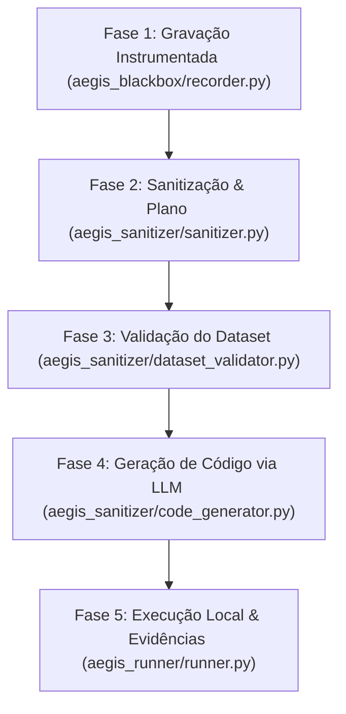

# Guia de Desenvolvimento de Automação: Aegis RPA Suite

Este documento define o ciclo de vida completo de engenharia de automação da suite **Aegis**, estabelecendo as etapas obrigatórias de descoberta, diagnóstico de DOM, geração de código com padrões de resiliência e homologação de robôs Playwright + Python. Para a especificação arquitetural completa e o catálogo integral de padrões, ver [`aegis_architecture_manual.md`](aegis_architecture_manual.md) — este guia foca no fluxo de trabalho do desenvolvedor.

---

## 🗺️ Visão Geral do Ciclo de Desenvolvimento Aegis

O desenvolvimento de robôs na suite Aegis segue as **5 fases automatizadas do pipeline** para garantir 100% de estabilidade offline em runtime:



Só a **Fase 4** usa LLM — e mesmo assim apenas em design-time, para compilar o script. O robô compilado (`bot_producao.py`) roda em produção sem nenhuma chamada de IA por padrão; a camada cognitiva (`aegis_runner/cognitive_fallback.py`) só é acionada se `AEGIS_COGNITIVE_ENABLED=true` E um seletor estático falhar em runtime (ver seção 7).

---

## 🛠️ Fase 1: Gravação Instrumentada (Design-time)

Nunca comece escrevendo código diretamente ou usando gravadores automáticos ingênuos (como o `playwright codegen` bruto). A primeira fase é baseada em **gravação instrumentada**:

```powershell
python aegis_blackbox/recorder.py --url "https://portal.suaempresa.com.br/login" --output-dir "projects/meu_projeto" --control-port 9900
```

1. **Executar o Recorder:**
   * Abre um navegador headed (Chromium/Edge) com listeners de DOM injetados e interceptação de chamadas de rede HTTP.
   * O fluxo é executado manualmente de ponta a ponta seguindo o caminho feliz (Golden Path).
2. **Anotar Passos Críticos:**
   * Durante a gravação, utilize a interface flutuante do widget (servida na `--control-port`) para marcar transições importantes, como:
     * Campos com preenchimento reativo de backend (ex: inserção de CPF que auto-completa o nome).
     * Modais CDK Overlays que aparecem na tela de forma sobreposta.
     * Envio e validação de tokens SMS/E-mail.
3. **Saída:** `gravacao.json` (eventos brutos) + `dicionario.json` (dicionário semântico, incluindo `fallback_selectors` e `fill_strategy: "HUMAN_LIKE"` quando detectado) em `projects/meu_projeto/`.

---

## 🧼 Fase 2: Sanitização e Geração do Plano de Execução

Os logs da gravação manual contêm ruídos, cliques duplicados e requisições HTTP redundantes que precisam ser limpos:

```powershell
python aegis_sanitizer/sanitizer.py --project-dir projects/meu_projeto
```

1. **Sanitizar a Telemetria:**
   * `aegis_sanitizer/sanitizer.py` remove cliques/fills duplicados, reordena pares de dropdown mal capturados e aplica o Padrão Q (remoção de tokens dinâmicos de `has_text`).
2. **Gerar `relatorio.md` + `plano_execucao.json`:**
   * `relatorio.md` é o runbook consolidado (legível por humano e por LLM), com o caminho feliz e o mapa de seletores semanticamente estáveis (priorizando `data-testid`/IDs estáticos sobre XPaths voláteis, e sinalizando `fallback_selectors` disponíveis).
   * `plano_execucao.json` é o plano por `step_id` consumido pela Fase 4 — inclui a flag `weak_selector` (seletor ambíguo sem âncora) e, quando marcado manualmente via Cockpit após confirmação de QA, `flaky: true` (ver Padrão R).
3. **Contrato de alta fidelidade (schema v2):** o Sanitizer classifica em vez de deletar — nenhum evento capturado é perdido. O plano usa dois espaços de id disjuntos: `st_NNN` para steps emitíveis (`execution_hint` ausente ou `"required"`, ou explicitamente `"optional"`) e `sup_NNN` para steps suprimidos (`execution_hint: "skip"`), intercalados na posição física original com `step_role`/`suppression_reason` explicando o motivo. Um resumo `fidelity_summary` no topo do plano mostra `raw_events` × `steps_required`/`steps_optional`/`steps_suppressed`/`merges`. A Fase 4 vê os `sup_` de forma compacta e só os emite (reusando o `step_id` existente) quando uma correção acumulada ou o fluxo exigirem — nunca inventa um id novo.

---

## 🔍 Fase 3: Validação do Dataset + Checklist de Diagnóstico de DOM

Antes da geração de código, duas coisas acontecem — uma automatizada, uma manual/assistida por LLM:

### 3.1. Validação automática (Firewall)
```powershell
python aegis_sanitizer/dataset_validator.py --dataset projects/meu_projeto/dataset_inicial.json --project-dir projects/meu_projeto
```
`aegis_sanitizer/dataset_validator.py` valida `dataset_inicial.json`/`.csv` contra o `dicionario.json`. É **tolerante por padrão** — só bloqueia erros estruturais críticos (ex.: coluna obrigatória totalmente ausente), nunca problemas de formato de valor.

### 3.2. Checklist de diagnóstico de DOM (leitura do `relatorio.md`)
Ao ler o `relatorio.md` da Fase 2 — seja você ou o LLM na Fase 4 — mapeie as "estranhezas" e comportamentos hostis da interface antes de confiar cegamente no plano gerado:

* **Roteamento de URL:** A página é uma Single Page Application (SPA)? Ela altera a URL ao avançar de etapa ou mascara o estado global sob a mesma rota?
* **Shadow DOM:** Existem Web Components isolando elementos críticos (ex: botões de envio aninhados)? → Padrão A.
* **Deadlocks de Formulário:** O preenchimento de um campo desabilita temporariamente outro até a conclusão de uma requisição reativa? → Padrão C.
* **CDK Overlays:** Os menus suspensos expandem para fora da viewport física, gerando exceções de scroll no Playwright? → Padrão D.
* **Timings de API:** Há loaders/spinners que bloqueiam interações mesmo quando o elemento de destino já está visível? → Padrão J.
* **Campos Anti-Bot:** O `dicionario.json` marcou algum campo com `fill_strategy: "HUMAN_LIKE"`? → Padrão M, obrigatório usar `fill_human_like`.

---

## 💻 Fase 4: Geração de Código via LLM (compila código Zero-LLM-Runtime)

```powershell
python aegis_sanitizer/code_generator.py --project-dir projects/meu_projeto
```

Requer `AEGIS_COGNITIVE_ENABLED=true` + `AEGIS_COGNITIVE_API_KEY`/`AEGIS_COGNITIVE_PROVIDER`/`AEGIS_COGNITIVE_MODEL` configurados (`.env` do projeto ou raiz do framework). O `code_generator.py` lê `plano_execucao.json` + `dicionario.json` + dataset validado, injeta o catálogo de padrões (`aegis_mentor/skills/rpa-copilot-coder.md`) no prompt, e chama o LLM para compilar `bot_producao.py` + `skills_lib.py` em `projects/meu_projeto/tests/<slug_do_teste>/code/`.

**Importante:** o código gerado nunca chama `page.click()`/`page.fill()` diretamente — sempre através dos métodos resilientes do `TransactionRunner` (`aegis_runner/runner.py`), que já embutem `force=True`, os sensores `CLICK_NO_EFFECT`/`ENABLE_TIMEOUT`, a cadeia de `fallback_selectors` e o registro de `needs_review`. Os exemplos abaixo mostram como cada padrão se traduz no código realmente compilado:

### 🧬 Padrão A: Piercing de Shadow DOM
```python
runner.click_resilient(
    page,
    selector="#host-checkout >> #btn-submit-payment",
    target_description="Confirmar pagamento",
    step_id="st_012"
)
```

### 👁️ Padrão D: Clique Forçado via Viewport Evaluation
O fallback de JS-click sob CDK Overlay já é interno ao `click_resilient` — o código gerado só precisa do seletor:
```python
runner.click_resilient(
    page,
    selector=".cdk-overlay-pane >> mat-option:has-text('Banco do Brasil')",
    target_description="Selecionar banco 'Banco do Brasil'",
    step_id="st_018"
)
```

### 🚦 Padrão C: Desvio de Deadlock de Formulário
```python
# [PASSO 5] Limpa campo dependente, preenche o pai, valida, preenche o filho
runner.fill_resilient(page, selector="#angular-field-b", text_val="", target_description="Limpar campo B", strategy="DIRECT", step_id="st_005a")
runner.fill_resilient(page, selector="#angular-field-a", text_val=row.get("campo_a", ""), target_description="Preencher campo A", strategy="DIRECT", step_id="st_005b")
runner.click_resilient(page, selector="#btn-validate-field-a", target_description="Validar campo A", step_id="st_005c")
runner.fill_resilient(page, selector="#angular-field-c", text_val=row.get("campo_c", ""), target_description="Preencher campo C", strategy="DIRECT", step_id="st_005d")
runner.fill_resilient(page, selector="#angular-field-b", text_val=row.get("campo_b", ""), target_description="Restabelecer campo B", strategy="DIRECT", step_id="st_005e")
```

### 🔁 Padrão F + ⏱️ Sensor `ENABLE_TIMEOUT`: Cliques Reativos e Botões Gated
Um botão que só habilita após validação assíncrona do backend **não precisa de loop manual no código gerado** — o sensor `ENABLE_TIMEOUT` do runner já cobre isso para qualquer seletor: espera a habilitação (timeout configurável), e se estourar, reexecuta os fills recentes antes de decidir por falha genuína.
```python
runner.click_resilient(
    page,
    selector="#btn-next-step",
    target_description="Avançar para a próxima etapa",
    step_id="st_020"
)
```

### ⏱️ Padrão J: Sincronização de Transições de API
Loaders/spinners que bloqueiam interação são tratados pelo padrão de espera explícita — sem `sleep` fixo:
```python
runner.click_resilient(page, selector="#btn-confirm-payment", target_description="Confirmar pagamento", step_id="st_030")
page.wait_for_selector("#payment-loader", state="hidden", timeout=60000)
page.locator("h2:has-text('Sucesso')").wait_for(state="visible", timeout=10000)
```

O catálogo completo (18 padrões, A a R) com problema/solução/exemplo vive em `aegis_mentor/skills/rpa-copilot-coder.md` — é a fonte de verdade que o `code_generator.py` lê a cada compilação; consulte-o para os padrões não cobertos aqui (B, E, G, H, K, L, M, N, O, P, Q, R).

---

## 🚦 Fase 5: Execução Local, Evidências e Homologação

```powershell
python projects/meu_projeto/tests/<slug_do_teste>/code/bot_producao.py
```

A fase final atesta a estabilidade do robô através de instrumentação de logs, controle de exceções e captação de evidências, tudo orquestrado pelo `TransactionRunner` (`aegis_runner/runner.py`):

1. **Isolamento por linha:** o `TransactionRunner.run()` cria uma página Playwright isolada para cada linha do dataset — falha, diálogo ou crash numa linha nunca afeta as demais.
2. **Modo E2E do portal alvo:** se o site de destino suportar uma flag de teste determinística (ex.: `?e2e=true` para desativar simulações de latência aleatória do servidor), use-a na URL de entrada — é uma convenção do site alvo, não uma feature do framework.
3. **Instrumentação de Logs:** cada passo é logado via `[AEGIS_STEP]` (controlável por `AEGIS_STEP_LOGS_REALTIME`) e consolidado em `historico_passos.json` + relatório CSV, gravados em `projects/meu_projeto/tests/<slug_do_teste>/executions/run_<timestamp>/reports/`.
4. **Screenshots por passo:** opcionais via `AEGIS_STEP_SCREENSHOTS=true`, salvos na mesma pasta de execução — nunca em caminho hardcoded fora da estrutura do projeto.
5. **Estrutura Organizacional:** os motores genéricos (`aegis_runner`, `aegis_blackbox`, `aegis_cockpit`, `aegis_sanitizer`, `aegis_mentor`) são isolados e não contêm código específico de processos. Todos os RPAs ficam em `projects/<slug>/tests/<slug_do_teste>/code/bot_producao.py`.

---

## 🔒 6. Política de Segurança, Isolamento de RPAs e Configurações via Ambiente
Para manter o ecossistema Aegis em conformidade com as melhores práticas de segurança e governança corporativa, as seguintes regras são obrigatórias:

* **Carregamento via `os.getenv`:** Todas as URLs de portais, usuários, senhas e tokens de API devem ser carregadas via variáveis de ambiente (`.env` do projeto).
* **Validação Estrita:** Caso as variáveis essenciais de produção estejam vazias no ambiente, o código do robô deve levantar um erro estruturado (`ValueError`), interrompendo a execução de forma segura:
  ```python
  portal_user = os.getenv("PORTAL_USER")
  portal_password = os.getenv("PORTAL_PASSWORD")
  if not portal_user or not portal_password:
      raise ValueError("Erro: Variáveis PORTAL_USER e PORTAL_PASSWORD não definidas!")
  ```
* **Zero Hardcodes de dados de negócio:** valores observados na gravação (CPF, nome, opção de dropdown) nunca são hardcoded no código gerado — sempre `row.get("<chave_semantica>", "")`, mesmo que a telemetria exiba o valor literal.
* **Isolamento de Projetos e Proteção do Core Framework (Aegis Suite Blindado):**
  * **Não Geração de Arquivos na Raiz:** Não devem ser gerados arquivos na raiz do projeto (exceto em casos de extrema necessidade, como atualizações de dependências globais no `requirements.txt`).
  * **Artefatos Específicos Isolados:** Artefatos específicos de um sistema (logs de execução, capturas de tela, datasets e relatórios temporários) só podem ser gerados e salvos dentro da própria estrutura de pastas do projeto (`projects/<slug>/`), nunca dentro de pastas da suíte do Aegis.
  * **Separação Externa de Projetos:** Tudo o que for específico de um processo automatizado (RPA) deve ser externo à pasta principal do Aegis. A estrutura do Aegis (`aegis_runner`, `aegis_blackbox`, `aegis_cockpit`, `aegis_sanitizer`, `aegis_mentor`) é um motor blindado e deve ser protegida contra alterações específicas de robôs.
  * **Localização de `projects/` e `telemetry_data/`:** ambas ficam externas ao core do Aegis, nunca aninhadas dentro das pastas internas de ferramentas do framework.

---

## 🧠 7. Camada Cognitiva e Auto-Correção (Self-Healing)
Quando habilitada, a camada cognitiva (`aegis_runner/cognitive_fallback.py`, classe `CognitiveGateway`) atua como contingência automática para aumentar a resiliência do robô — mas é acionada **pelo runner internamente**, como último recurso da cadeia de resiliência (depois de `fallback_selectors` esgotados), não chamada manualmente pelo código do robô gerado.

* **Ativação:** Defina `AEGIS_COGNITIVE_ENABLED=true`.
* **Provedores Suportados:** OpenRouter (padrão), LiteLLM, ou qualquer endpoint compatível com a API da OpenAI — configurados via `AEGIS_COGNITIVE_PROVIDER`/`AEGIS_COGNITIVE_BASE_URL`.
* **Self-Healing de Cliques (`self_healing_click`):** se um seletor estático (e seus `fallback_selectors`) falharem, captura uma screenshot e solicita à LLM as coordenadas percentuais do elemento, clicando via mouse Playwright. Bloqueado quando o passo é chamado com `strict=True` (ver Padrão Q).
* **Diagnóstico de Falhas (`diagnose_failure`):** em erro fatal insolúvel, envia a screenshot + o histórico de passos (`steps_history`) para a LLM gerar um diagnóstico visual/semântico de causa raiz antes do encerramento.

Trecho ilustrativo de como o `TransactionRunner` usa o gateway internamente (não é código que o `code_generator.py` emite no `bot_producao.py` — o robô gerado só chama `runner.click_resilient(...)`):
```python
from aegis_runner.cognitive_fallback import CognitiveGateway

cognitive_gateway = CognitiveGateway(project_dir=project_dir)  # carrega .env do projeto

try:
    page.click("#checkbox-pcd", timeout=3000)
except Exception:
    if cognitive_gateway.enabled and not strict:
        cognitive_gateway.self_healing_click(page, "#checkbox-pcd", "Checkbox de isenção fiscal PCD")
    else:
        raise
```
