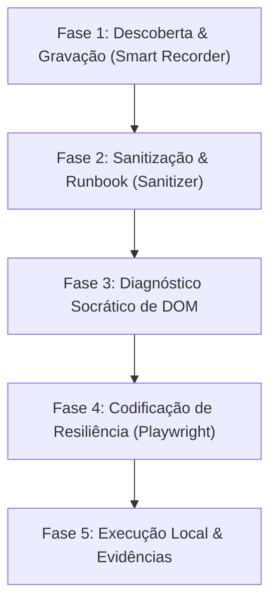

# Guia de Desenvolvimento de Automação: Aegis RPA Suite

Este documento define o ciclo de vida completo de engenharia de automação da suite **Aegis**, estabelecendo as etapas obrigatórias de descoberta, diagnóstico de DOM, codificação com padrões de resiliência e homologação de robôs Playwright + Python.

---

## 🗺️ Visão Geral do Ciclo de Desenvolvimento Aegis

O desenvolvimento de robôs na suite Aegis é dividido em 5 fases sequenciais para garantir 100% de estabilidade offline em runtime:



---

## 🛠️ Fase 1: Descoberta e Gravação Inteligente (Design-time)

Nunca comece escrevendo código diretamente ou usando gravadores automáticos ingênuos (como o `playwright codegen` bruto). A primeira fase é baseada em **gravação instrumentada**:

1. **Executar o Smart Recorder:**
   * O desenvolvedor inicia o navegador Edge instrumentado com escuta de eventos de DOM e interceptação de chamadas de rede HTTP.
   * O fluxo é executado manualmente de ponta a ponta seguindo o caminho feliz (Golden Path).
2. **Anotar Passos Críticos:**
   * Durante a gravação, utilize a interface flutuante do gravador para marcar transições importantes, como:
     * Campos com preenchimento reativo de backend (ex: inserção de CPF que auto-completa o nome).
     * Modais CDK Overlays que aparecem na tela de forma sobreposta.
     * Envio e validação de tokens SMS/E-mail.

---

## 🧼 Fase 2: Sanitização e Geração do Runbook

Os logs da gravação manual contêm ruídos, movimentos indesejados de mouse e requisições HTTP redundantes que precisam ser limpos:

1. **Sanitizar a Telemetria:**
   * Execute o script `telemetry_sanitizer.py` apontando para o arquivo de log JSON da gravação.
   * O sanitizador remove cliques duplicados em um mesmo elemento e normaliza os inputs de teclado.
2. **Gerar o Runbook de Seletores:**
   * A saída do sanitizador é um documento contendo o caminho feliz consolidado e um mapa de seletores semanticamente estáveis (priorizando IDs estáticos, names e classes CDK invariantes em detrimento de XPaths relativos e voláteis).

---

## 🔍 Fase 3: Entrevista de Diagnóstico Socrático de DOM

Antes de codificar, analise a anatomia do portal para mapear as "estranhezas" e comportamentos hostis da interface:

* **Roteamento de URL:** A página é uma Single Page Application (SPA)? Ela altera a URL ao avançar de etapa ou mascara o estado global sob a mesma rota?
* **Shadow DOM:** Existem Web Components isolando elementos críticos (ex: botões de envio aninhados)?
* **Deadlocks de Formulário:** O preenchimento de um campo desabilita temporariamente outro até a conclusão de uma requisição reativa?
* **CDK Overlays:** Os menus suspensos expandem para fora da viewport física, gerando exceções de scroll no Playwright?
* **Timings de API:** Há loaders/spinners que bloqueiam interações mesmo quando o elemento de destino já está visível?

---

## 💻 Fase 4: Codificação de Resiliência (Zero-LLM Runtime)

O código gerado deve rodar de forma puramente determinística e offline (sem chamadas a LLMs em tempo de execução). Aplique obrigatoriamente os **Padrões de Resiliência Aegis**:

### 🧬 Padrão A: Piercing de Shadow DOM
Utilize o operador nativo `>>` do Playwright no mesmo seletor para atravessar barreiras de Shadow DOM de forma transparente:
```python
page.click("#host-checkout >> #btn-submit-payment")
```

### 👁️ Padrão D: Clique Forçado via Viewport Evaluation
Para menus flutuantes que estouram os limites físicos da tela, implemente uma estrutura `try-except` com fallback limpo via dispatch de evento nativo (DOM click) se o clique físico falhar:
```python
option = page.locator("mat-option:has-text('Banco do Brasil')")
try:
    option.wait_for(state="visible", timeout=3000)
    option.click(timeout=3000)
except TimeoutError:
    option.dispatch_event("click")  # Fallback direto na árvore do DOM
```

### 🚦 Padrão C: Desvio de Deadlock de Formulário
Caso o preenchimento de um campo dependa de uma chamada de rede iniciada pelo campo anterior, utilize asserções de polling inteligente via `expect` em vez de sleeps estáticos:
```python
from playwright.sync_api import expect

coupon_input.fill("DESCONTO10")
coupon_input.press("Enter")

# Aguarda explicitamente até que o campo dependente perca a flag disabled
expect(installments_select).to_be_enabled(timeout=10000)
installments_select.select_option("3")
```

### 🔁 Padrão F: Cliques Reativos com Checagem de Efeito Colateral
Para botões que demoram a vincular listeners Javascript (event binding delay), implemente um loop curto de repetição estruturado em intervalos pequenos (ex: 800ms) que verifica continuamente se o efeito colateral esperado (mudança de URL ou visibilidade de um novo elemento de destino) ocorreu:
```python
start = time.time()
while time.time() - start < 10:
    try:
        page.click("#btn-next", force=True)
    except:
        pass
    time.sleep(0.5)
    if page.locator("#step-2-indicator").is_visible(timeout=200):
        break
```

### ⏱️ Padrão J: Sincronização de Transições de API
Sempre aguarde explicitamente a ocultação de loaders e a renderização de elementos invariantes exclusivos da tela subsequente após submissões lentas de dados:
```python
page.click("#btn-confirm-payment")
# Aguarda o sumiço do spinner
page.wait_for_selector("#payment-loader", state="hidden", timeout=60000)
# Assegura o carregamento do título final
page.locator("h2:has-text('Sucesso')").wait_for(state="visible", timeout=10000)
```

---

## 🚦 Fase 5: Execução Local, Evidências e Homologação

A fase final atesta a estabilidade do robô através de instrumentação de logs, controle de exceções e captação de evidências:

1. **Configurar Modo E2E:**
   * Acesse a SPA utilizando a flag dedicada de testes (`?e2e=true`) para desativar simulações de latência aleatórias do servidor e tornar as respostas determinísticas.
2. **Instrumentação de Logs (Telemetria):**
   * Utilize o módulo `logging` do Python para registrar o sucesso de cada etapa crítica da execução do robô.
3. **Bypass Digital de Canais Físicos:**
   * Em vistorias de veículos usados ou etapas de agendamento presencial, ative a rota de **Autovistoria Digital** (link de SMS) para destravar instantaneamente o formulário, contornando preenchimentos de calendários voláteis.
4. **Captura e Evidências Dinâmicas:**
   * Após a conclusão bem-sucedida, capture telas comprobatórias e salve-as dinamicamente no repositório de evidências (Brain) sem caminhos fixos (hardcoded), usando o helper de resolução dinâmica.
5. **Estrutura Organizacional Organizada:**
   * Os motores genéricos (`aegis_runner`, `aegis_blackbox`, `aegis_cockpit`) são isolados e não contêm códigos específicos de processos.
   * Todos os RPAs são armazenados no diretório `projects/` (ex: `projects/portal_segura_integracao_e2e/bot_portalsegura.py`).

---

## 🔒 6. Política de Segurança, Isolamento de RPAs e Configurações via Ambiente
Para manter o ecossistema Aegis em conformidade com as melhores práticas de segurança e governança corporativa, as seguintes regras são obrigatórias:

* **Carregamento via `os.getenv`:** Todas as URLs de portais, usuários, senhas e tokens de API devem ser carregadas via variáveis de ambiente.
* **Validação Estrita:** Caso as variáveis essenciais de produção estejam vazias no ambiente, o código do robô deve levantar um erro estruturado (`ValueError`), interrompendo a execução de forma segura:
  ```python
  portalsegura_user = os.getenv("PORTALSEGURA_USER")
  portalsegura_password = os.getenv("PORTALSEGURA_PASSWORD")
  if not portalsegura_user or not portalsegura_password:
      raise ValueError("Erro: Variáveis PORTALSEGURA_USER e PORTALSEGURA_PASSWORD não definidas!")
  ```
* **Isolamento de Projetos e Proteção do Core Framework (Aegis Suite Blindado):**
  * **Não Geração de Arquivos na Raiz:** Não devem ser gerados arquivos na raiz do projeto (exceto em casos de extrema necessidade, como atualizações de dependências globais no `requirements.txt`).
  * **Artefatos Específicos Isolados:** Artefatos específicos de um sistema (como logs de execução, capturas de tela, templates de CSV, datasets e relatórios temporários do Portal Segura) só podem ser gerados e salvos dentro da sua própria estrutura de pastas do projeto (ex: subpastas em `projects/`), nunca dentro de pastas da suíte do Aegis.
  * **Separação Externa de Projetos:** Tudo o que for específico de um processo automatizado (RPA) ou de um projeto deve ser externo à pasta principal do Aegis. A estrutura do Aegis (como `aegis_runner`, `aegis_blackbox`, `aegis_cockpit`, `aegis_sanitizer`, `aegis_mentor`) é um motor blindado e deve ser protegida contra alterações específicas de robôs.
  * **Localização de Projects e Telemetry_Data:** As pastas `projects/` (que armazena os códigos-fonte dos RPAs específicos) e `telemetry_data/` (que armazena os dados transacionais de inputs/outputs dos testes e execuções) devem ficar localizadas externamente à suíte core do Aegis (no nível de projeto ou sob diretórios de integração dedicados), nunca misturadas ou aninhadas dentro das pastas internas de ferramentas do framework.

---

## 🧠 7. Camada Cognitiva e Auto-Correção (Self-Healing)
Quando habilitada, a camada cognitiva (`cognitive_fallback.py`) atua como uma contingência automática e inteligente para aumentar a resiliência do robô:

* **Ativação:** Defina a variável de ambiente `AEGIS_COGNITIVE_ENABLED="true"`.
* **Provedores Suportados:** Compatível com gateways OpenAI-like (OpenRouter ou instâncias LiteLLM locais).
* **Self-Healing de Cliques:** Se um seletor estático falhar no Playwright, a função `self_healing_click` captura uma screenshot e solicita à LLM as coordenadas percentuais baseadas no contexto textual do elemento, clicando nas coordenadas via mouse Playwright.
* **Diagnóstico de Falhas:** No bloco final de exceções do robô (`except Exception`), o método `diagnose_failure` envia a imagem e o fragmento de DOM do erro para a LLM gerar um diagnóstico imediato da causa raiz da quebra.

```python
from cognitive_fallback import CognitiveGateway

# Inicializa Gateway Cognitivo
cognitive_gateway = CognitiveGateway()

try:
    page.click("#checkbox-pcd")
except Exception:
    if cognitive_gateway.enabled:
        # Tenta auto-correção via visão computacional da LLM
        cognitive_gateway.self_healing_click(page, "#checkbox-pcd", "Checkbox de isenção fiscal PCD")
    else:
        raise
```

